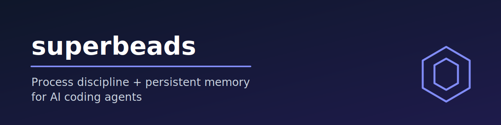

<p align="center"><a href="README.md">English</a> · <strong>中文</strong></p>

<p align="center"><em>⚠️ 本文档由 AI 机器翻译，可能存在术语或语义偏差。如有疑问，请以<a href="README.md">英文原文</a>为准。</em></p>

<p align="center">
  
</p>

<p align="center">
  <a href="LICENSE"></a>
  <a href=".claude-plugin/plugin.json"></a>
  <a href="https://github.com/DollarDill/beads-superpowers/stargazers"></a>
</p>

---

一款适用于 Claude Code、Codex、OpenCode 及另外 6 款 AI 编程智能体的插件，让你的智能体在编写代码前先写测试、有条不紊地调试而非盲目猜测，并记住昨天做了什么。可组合技能强制执行这些实践；基于 Dolt 的问题追踪器在会话间保持上下文。

## 工作原理

开始任务时，智能体先运行 **brainstorming** 以在触碰代码前明确需求，再通过 **writing-plans** 将工作拆解为 `bd` 追踪的步骤——这些步骤在会话重启后仍然保留。

实现阶段遵循 **test-driven-development**（始终先写失败的测试），并可通过 **subagent-driven-development** 扇出到并行子智能体——每个智能体在各自的 git worktree 中工作。

`bd` 将每项任务、决策和备注存储在本地 Dolt 数据库中，因此智能体在下次会话时能从上次中断处精确接续，无需依赖聊天记录。

这一切之下是生产级标准：智能体将每项任务视为真实用户依赖的事项，因此它不会为了速度偷偷走捷径、遗漏需求或削弱安全控制。

## 功能概览

### 测试

| 技能 | 功能说明 |
|------|---------|
| `test-driven-development` | RED-GREEN-REFACTOR 循环——铁律：没有失败的测试，不写实现代码 |
| `verification-before-completion` | 主张之前先有证据——标记完成前必须提供证明 |

### 调试

| 技能 | 功能说明 |
|------|---------|
| `systematic-debugging` | 提出任何修复方案前进行 4 阶段根因分析 |

### 协作

| 技能 | 功能说明 |
|------|---------|
| `requesting-code-review` | 按结构化标准派遣代码审查子智能体 |
| `receiving-code-review` | 抗谄媚式接收——按实际价值评估每项发现 |
| `subagent-driven-development` | 每项任务启用全新智能体，含规格说明与质量审查；独立任务支持并行批处理模式 |
| `dispatching-parallel-agents` | 扇出到 2 个以上无共享状态的独立智能体 |

### 项目管理

| 技能 | 功能说明 |
|------|---------|
| `brainstorming` | 写代码前进行苏格拉底式设计讨论——生成规格说明 bead |
| `stress-test` | 对计划进行对抗性审问并提供推荐答案 |
| `writing-plans` | 将工作拆解为可执行的小任务，每项均作为 `bd` bead 追踪 |
| `executing-plans` | 在单次会话内批量执行计划 |
| `using-git-worktrees` | 每项任务使用独立的开发分支 |
| `finishing-a-development-branch` | 合并/PR 流程 + Land the Plane（关闭 beads，推送） |
| `document-release` | 发布后文档审计——保持 README、CHANGELOG 和 ARCHITECTURE 同步 |
| `project-init` | Beads/Dolt 数据库设置、初始化与恢复 |
| `getting-up-to-speed` | 会话定向——加载 `bd` 上下文并生成当前状态摘要 |
| `memory-curator` | 会话结束/按需的记忆整合——对 `bd` 记忆库去重并清理过时记忆 |
| `session-handoff` | 人工调用 —— 生成有据可查的交接文档 + 续接记忆，以恢复进行中的工作 |
| `research-driven-development` | 并行研究智能体 → 综合知识库文档 |
| `write-documentation` | 人类品质的文档——14 条规则写作体系，以上下文优先起草 |

### 元技能

| 技能 | 功能说明 |
|------|---------|
| `using-superpowers` | 引导程序——在会话开始时注入，路由到正确的技能 |
| `writing-skills` | 用于创建或修改本插件技能的元技能 |
| `auditing-upstream-drift` | 检测相对于上游 superpowers 和 beads 版本的过时情况 |

## 文档

**[dollardill.github.io/beads-superpowers](https://dollardill.github.io/beads-superpowers/)** — 快速入门、方法论、技能参考、示例工作流与使用技巧。

## 快速开始

最快路径——Claude Code 原生插件安装：

```bash
brew install beads                    # 1. Install bd (requires beads v1.1.0+)
# From your shell:
claude plugin marketplace add DollarDill/beads-superpowers
claude plugin install beads-superpowers@beads-superpowers-marketplace
# Or, inside a Claude Code session:
# /plugin marketplace add DollarDill/beads-superpowers
# /plugin install beads-superpowers@beads-superpowers-marketplace
# Then in your project directory:
bd init                               # 2. Bootstrap the Dolt database for this project
```

开启新的 Claude Code 会话，输入"where are we"——智能体将加载你的 `bd` 上下文，从上次中断处继续。

使用其他智能体？请参阅[安装](#安装)，了解在 Codex、OpenCode、Cursor、GitHub Copilot CLI、Kimi Code、Antigravity、Factory Droid 和 Pi 上的原生安装方法。

## 前提条件

**先安装 `bd`，再安装插件。** 其钩子在每次会话启动时调用 `bd`；若未安装，钩子将静默失败，导致丢失持久记忆。上方快速开始使用 Homebrew，任何平台也可使用 `npm install -g @beads/bd`。通过 `bd version` 验证安装。

**注意：** 原生插件安装（第 1 层）会安装技能和钩子，但不会执行 `bd init`——请在每个项目中手动运行。

## 安装

> **⚠️ 共存警告：** 请勿与 [obra/superpowers](https://github.com/obra/superpowers) 同时安装。技能名称存在冲突——请二选一。

### 第 1 层——已验证

这些路径经过端到端测试。优先使用。

#### Claude Code

```bash
claude plugin marketplace add DollarDill/beads-superpowers
claude plugin install beads-superpowers@beads-superpowers-marketplace
```

或在 Claude Code 会话内通过斜杠命令执行：`/plugin marketplace add DollarDill/beads-superpowers`，然后 `/plugin install beads-superpowers@beads-superpowers-marketplace`。

#### Codex CLI

```bash
codex plugin marketplace add DollarDill/beads-superpowers
codex plugin install beads-superpowers@beads-superpowers-marketplace
```

安装后，在 `~/.codex/config.toml` 中启用钩子：

```toml
[features]
codex_hooks = true
```

#### OpenCode

```bash
curl -fsSL https://raw.githubusercontent.com/DollarDill/beads-superpowers/main/install.sh | bash
```

安装程序检测到 OpenCode 后，会将技能复制到 `~/.config/opencode/skills/`，并将 TypeScript 插件复制到 `~/.config/opencode/plugins/`（自动激活）。

### 第 2 层——尽力支持

配置已验证；未经我们端到端测试。请知悉后使用。

#### Cursor

```text
/add-plugin beads-superpowers
```

在 Cursor 智能体内运行此命令。通过 Marketplace UI 更新。

#### GitHub Copilot CLI

```bash
copilot plugin marketplace add DollarDill/beads-superpowers
copilot plugin install beads-superpowers@beads-superpowers-marketplace
```

更新：

```bash
copilot plugin update beads-superpowers
```

注意：使用 Claude 插件回退方案（通过共享的 `hooks/hooks.json` 加载技能和 session-start），与上游相同机制；会话启动上下文注入需要 Copilot CLI v1.0.11+。

#### Kimi Code

```text
/plugins install https://github.com/DollarDill/beads-superpowers
```

安装后运行 `/new` 以启动含插件的新会话。

#### Antigravity

```bash
agy plugin install https://github.com/DollarDill/beads-superpowers
```

注意：复用 Claude 插件清单——与上游验证的机制相同。

#### Factory Droid

```bash
droid plugin marketplace add https://github.com/DollarDill/beads-superpowers
droid plugin install beads-superpowers@beads-superpowers-marketplace
```

注意：复用 Claude 插件清单——与上游验证的机制相同。

#### Pi

```bash
pi install git:github.com/DollarDill/beads-superpowers
```

#### 通用回退（npx）

> **从 ≤0.8.2 版本升级：** 早期版本注册了一个每次提示都会触发的提醒钩子，现已不再随插件提供。如果你的 `~/.claude/settings.json` 中仍引用 `superpowers-reminder.sh`，请先备份，然后移除该条目：
>
> ```bash
> cp ~/.claude/settings.json ~/.claude/settings.json.bak
> python3 -c "import json,os;p=os.path.expanduser('~/.claude/settings.json');d=json.load(open(p));H=d.get('hooks',{});U=H.get('UserPromptSubmit',[]);[m.update({'hooks':[h for h in m.get('hooks',[]) if 'superpowers-reminder' not in h.get('command','')]}) for m in U];U=[m for m in U if m.get('hooks')];(H.update({'UserPromptSubmit':U}) if U else H.pop('UserPromptSubmit',None));json.dump(d,open(p,'w'),indent=2)"
> ```

仅安装技能——不包含钩子。技能激活依赖于你所用智能体自身的原生技能发现机制。

```bash
npx skills add DollarDill/beads-superpowers -g --copy -y
```

如需完整体验（会话启动时注入技能上下文 + 组合式 beads 上下文），请使用插件安装方式（上文的 Claude Code / Codex / OpenCode）或脚本安装。若要在 npx 安装中获取 beads 上下文，运行 `bd setup claude`（beads 自带的钩子安装器）。

### 替代方案：脚本安装（`curl | bash`）

```bash
curl -fsSL https://raw.githubusercontent.com/DollarDill/beads-superpowers/main/install.sh | bash
```

该脚本的作用不仅限于复制文件。当你需要以下任何功能时使用它：

- **Beads/Dolt 初始化** — 自动检测 `bd` 是否已安装并引导设置
- **钩子注册** — 将 SessionStart 条目写入 settings.json（使用脚本安装路径时必需）
- **`yegge.md` 编排器** — 可选附加组件：仅在传入 `--with-yegge` 时安装。该标志会强制使用脚本化的 tarball/git 安装层级（该次运行会跳过 plugin 和 npx 层级），因此无法在一条命令中与插件管理的安装方式组合使用
- **版本锁定** — `--version X.Y.Z` 用于可重现的 CI 安装
- **CI 环境** — 使用 `--yes --skip-checksum` 进行无人值守运行

支持：`--yes`（跳过提示）、`--version X.Y.Z`、`--with-yegge`、`--dry-run`、`--skip-checksum`、`--uninstall`。

## 基于

- **[Superpowers](https://github.com/obra/superpowers)** by Jesse Vincent — 技能体系与开发实践
- **[Beads](https://github.com/gastownhall/beads)** by Steve Yegge — 跨会话记忆的持久化问题追踪

## 贡献

参见 [`CONTRIBUTING.md`](CONTRIBUTING.md)。欢迎在 **[Discussions](https://github.com/DollarDill/beads-superpowers/discussions/27)** 提出想法。

## 许可证

[MIT](LICENSE)
