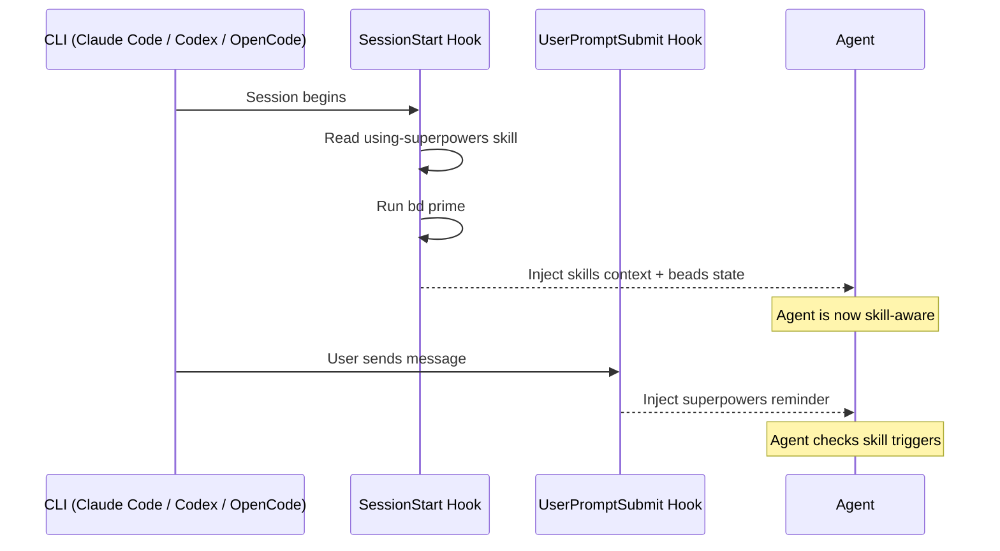

# Getting Started

## Prerequisites

You need at least one supported CLI and the **`bd` CLI** ([gastownhall/beads](https://github.com/gastownhall/beads)).

**Supported CLIs:** [Claude Code](https://claude.ai/claude-code), [Codex CLI](https://github.com/openai/codex), [OpenCode](https://github.com/anomalyco/opencode). The installer auto-detects which you have and installs accordingly.

Install `bd`:

```bash
brew install beads          # macOS / Linux
# or
npm install -g @beads/bd    # any platform
```

Verify with `bd version`.

**Optional:** A [DoltHub](https://dolthub.com) account if you want cross-session sync via `bd dolt push/pull`. Without it, beads still works locally.

## Install the plugin

### curl (recommended — works with all supported CLIs)

```bash
curl -fsSL https://raw.githubusercontent.com/DollarDill/beads-superpowers/main/install.sh | bash
```

The installer detects which CLIs are on your system and installs skills and hooks for each:

| CLI | Skills path | Hooks / Plugin |
|-----|------------|----------------|
| Claude Code | `~/.claude/skills/` | SessionStart + UserPromptSubmit hooks in `settings.json` |
| Codex | `~/.codex/skills/` | Enable with `codex_hooks = true` in `~/.codex/config.toml` |
| OpenCode | `~/.config/opencode/skills/` | TypeScript plugin at `~/.config/opencode/plugins/` (active automatically) |

Supports `--yes` (skip prompts), `--version X.Y.Z` (pin version), `--dry-run` (preview), and `--uninstall`.

### Claude Code Marketplace

```bash
claude plugin marketplace add DollarDill/beads-superpowers
claude plugin install beads-superpowers@beads-superpowers-marketplace
```

Or as slash commands inside a Claude Code session: `/plugin marketplace add ...` and `/plugin install ...`.

### Codex CLI Marketplace

```bash
codex plugin marketplace add DollarDill/beads-superpowers
codex plugin install beads-superpowers@beads-superpowers-marketplace
```

After installing, enable hooks in `~/.codex/config.toml`:

```toml
[features]
codex_hooks = true
```

### npx (Vercel Skills CLI)

```bash
npx skills add DollarDill/beads-superpowers --all -y -g
# npx installs skills only — no hooks. Run the setup skill in your
# chosen agentic terminal to configure the SessionStart hook.
```

## First project setup

Initialise beads in your project:

```bash
cd your-project
bd init
```

This creates `.beads/` (config, metadata, git hooks), `CLAUDE.md`, and `AGENTS.md`. The plugin's session-start hook automatically detects if `bd setup claude` hooks are present and skips its own `bd prime` call, so no manual cleanup is needed.

### Dolt remote (optional)

For cross-session sync of your task history:

```bash
bd dolt remote add origin https://doltremoteapi.dolthub.com/your-org/your-repo
bd dolt push    # test the connection
```

## Verify it works

Start a fresh session in your CLI of choice, then:

1. **Check skills loaded:** Type `/skills` (Claude Code/Codex) or check the skill list in OpenCode — you should see {{ skill_count }} skills prefixed with `beads-superpowers:`
2. **Check beads works:** Run `bd ready` and `bd stats` in the terminal

If skills aren't showing, the plugin may not be installed for your CLI. If `bd ready` fails, beads isn't initialised in this project (`bd init`).

## How the hooks work

The plugin registers two hooks via `hooks/hooks.json`:

**SessionStart** fires on every session start, clear, and compact. It reads the `using-superpowers` skill (which routes to all other skills), runs `bd prime` (captures beads state and persistent memories) unless it detects `bd prime` is already registered as a hook elsewhere, and outputs the combined context (~2–3k tokens).

**UserPromptSubmit** fires on every user message. It injects a reminder listing all {{ invocable_count }} invocable skills with their trigger conditions — "bug → systematic-debugging", "new feature → brainstorming", etc. This keeps the agent from forgetting about skills mid-session.



## Configuration

**Instruction priority** when things conflict:

1. Your project's `CLAUDE.md` (highest)
2. Plugin skills
3. Default system prompt (lowest)

To override a skill's behaviour, add instructions to your project's `CLAUDE.md` — no need to fork the plugin.

**Beads project config** lives in `.beads/config.yaml`. The defaults work for most projects.

## Troubleshooting

**Skills not loading** — Run `/plugins` to check the plugin is installed, then `/skills` to check skills are visible. If missing, reinstall: `claude plugin marketplace update beads-superpowers-marketplace`.

**`bd: command not found`** — Beads isn't installed or isn't on your PATH. Run `brew install beads` or `npm install -g @beads/bd`, then verify with `bd version`.

**No `.beads` directory** — Run `bd init` in your project directory. The plugin automatically handles duplicate hook detection.

**Double context injection** — The plugin detects `bd setup claude` hooks in project and global settings and automatically skips its own `bd prime` call. If you still see duplicates, run `bd setup claude --remove`.

**Stale plugin cache** — The cache doesn't update when you edit skill files locally. Either symlink the cache to your checkout:

```bash
rm -rf ~/.claude/plugins/cache/beads-superpowers-marketplace/beads-superpowers/{{ version }}
ln -s ~/workplace/beads-superpowers \
  ~/.claude/plugins/cache/beads-superpowers-marketplace/beads-superpowers/{{ version }}
```

Or reinstall. Note: `claude plugin update` has a known [cache bug](https://github.com/anthropics/claude-code/issues/14061) — the symlink is more reliable.

**Hook not firing** — Check the hook is executable: `chmod +x hooks/session-start`.

**`bd dolt push` fails** — You need a Dolt remote configured first (`bd dolt remote add origin <url>`). If you don't need remote sync, the failure is harmless — beads works fine locally.
