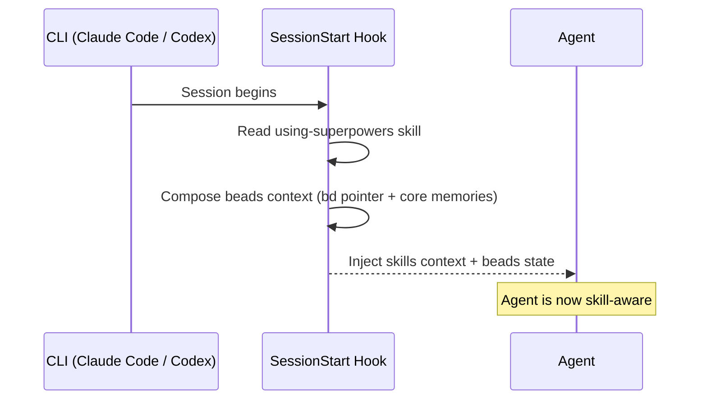

!!! warning "机器翻译"
    本页面由 AI 自动翻译，可能存在术语或语义偏差。如有疑问，请以[英文原文](getting-started.md)为准。

# 快速开始

## 前提条件

**`bd` 必须在插件生效之前安装。** 该插件注册的钩子在每次会话启动时调用 `bd`；如果 `bd` 不存在，这些钩子将静默失败，您将丢失持久记忆。

```bash
brew install beads          # macOS / Linux
# or
npm install -g @beads/bd    # any platform
```

使用 `bd version` 验证安装。然后安装插件（见下文），再在每个项目中运行 `bd init`。

**注意：** 原生插件安装（第 1 层）会自动安装技能和钩子。它不会运行 `bd init`——您必须在每个项目中自行完成。

**可选：** 如果您需要通过 `bd dolt push/pull` 实现跨会话同步，则需要一个 [DoltHub](https://dolthub.com) 账户。没有它，Beads 仍然可以在本地正常工作。

!!! info "深入了解 — 上游 Beads 文档"
    - [安装指南](https://gastownhall.github.io/beads/getting-started/installation) — `bd` 的所有安装渠道（brew、npm、curl、go）、平台说明与升级

## 支持的平台

### 第 1 层 — 已验证

这些路径经过端到端测试，推荐优先使用。

| CLI | 安装方式 |
|-----|---------------|
| Claude Code | 原生插件市场（见下文） |
| Codex CLI | 原生插件市场 + `codex_hooks = true`（见下文） |
| OpenCode | curl 安装程序（见下文） |

### 第 2 层 — 尽力而为

配置已验证；未经我们端到端测试。请在了解这一情况的前提下使用。

| CLI | 安装 | 更新 | 备注 |
|-----|---------|--------|-------|
| Cursor | `/add-plugin beads-superpowers`（在 Cursor Agent 中） | 市场 UI | 配置已由我们验证；未经端到端测试 |
| GitHub Copilot CLI | `copilot plugin marketplace add DollarDill/beads-superpowers` then `copilot plugin install beads-superpowers@beads-superpowers-marketplace` | `copilot plugin update beads-superpowers` | 使用 Claude 插件回退（技能 + 通过共享 `hooks/hooks.json` 的 session-start），与上游相同的机制；需要 Copilot CLI v1.0.11+ |
| Kimi Code | `/plugins install https://github.com/DollarDill/beads-superpowers`（之后运行 `/new`） | — | |
| Antigravity | `agy plugin install https://github.com/DollarDill/beads-superpowers` | — | 复用 Claude 插件清单——与上游已验证的相同机制；未经我们端到端测试 |
| Factory Droid | `droid plugin marketplace add https://github.com/DollarDill/beads-superpowers` then `droid plugin install beads-superpowers@beads-superpowers-marketplace` | — | 复用 Claude 插件清单——与上游已验证的相同机制；未经我们端到端测试 |
| Pi | `pi install git:github.com/DollarDill/beads-superpowers` | — | 配置已由我们验证；未经端到端测试 |

## 安装插件

> **⚠️ 共存警告：** 请勿与 [obra/superpowers](https://github.com/obra/superpowers) 同时安装。技能名称会冲突——请二选一。

### Claude Code

```bash
claude plugin marketplace add DollarDill/beads-superpowers
claude plugin install beads-superpowers@beads-superpowers-marketplace
```

或在 Claude Code 会话中使用斜杠命令：`/plugin marketplace add DollarDill/beads-superpowers`，然后 `/plugin install beads-superpowers@beads-superpowers-marketplace`。

### Codex CLI

```bash
codex plugin marketplace add DollarDill/beads-superpowers
codex plugin install beads-superpowers@beads-superpowers-marketplace
```

安装后，在 `~/.codex/config.toml` 中启用钩子：

```toml
[features]
codex_hooks = true
```

### OpenCode

```bash
curl -fsSL https://raw.githubusercontent.com/DollarDill/beads-superpowers/main/install.sh | bash
```

安装程序检测到 OpenCode 后，会将技能复制到 `~/.config/opencode/skills/`，并将 TypeScript 插件复制到 `~/.config/opencode/plugins/`（自动激活）。

### 脚本安装（`curl | bash`）

当您需要的不仅仅是普通插件安装时，curl 安装程序同样适用于 Claude Code 和 Codex：

```bash
curl -fsSL https://raw.githubusercontent.com/DollarDill/beads-superpowers/main/install.sh | bash
```

安装程序自动检测系统上的 CLI 并为每个 CLI 安装技能和钩子：

| CLI | 技能路径 | 钩子 / 插件 |
|-----|------------|----------------|
| Claude Code | `~/.claude/skills/` | `settings.json` 中的 SessionStart 钩子 |
| Codex | `~/.codex/skills/` | 在 `~/.codex/config.toml` 中使用 `codex_hooks = true` 启用 |
| OpenCode | `~/.config/opencode/skills/` | `~/.config/opencode/plugins/` 处的 TypeScript 插件（自动激活） |

在以下任一情况下，请使用脚本安装：

- **Beads/Dolt 引导** — 自动检测 `bd` 是否已安装并引导配置
- **钩子注册** — 将 SessionStart 条目写入 `settings.json`（使用 npx 或手动安装路径时必需）
- **`yegge.md` 编排器** — 可选附加组件：仅在传入 `--with-yegge` 时安装。该标志会强制使用脚本化的 tarball/git 安装层级（该次运行会跳过 plugin 和 npx 层级），因此无法在一条命令中与插件管理的安装方式组合使用
- **版本固定** — 使用 `--version X.Y.Z` 实现可重现的 CI 安装
- **CI 环境** — 使用 `--yes --skip-checksum` 进行无人值守运行

支持 `--yes`（跳过提示）、`--version X.Y.Z`、`--with-yegge`、`--dry-run`、`--skip-checksum` 和 `--uninstall`。

### npx（Vercel Skills CLI）

```bash
npx skills add DollarDill/beads-superpowers -a claude-code -g --copy -y
# Use -a codex to also install for Codex CLI.
```

仅安装技能——不包含钩子。技能激活依赖于你所用智能体自身的原生技能发现机制。如需完整体验（会话启动时注入技能上下文 + 组合式 beads 上下文），请使用插件安装方式或上文的脚本安装。若要在 npx 安装中获取 beads 上下文，运行 `bd setup claude`（beads 自带的钩子安装器）。

## 首次项目设置

在您的项目中初始化 Beads：

```bash
cd your-project
bd init
```

这将创建 `.beads/`（配置、元数据、git 钩子）、`CLAUDE.md` 和 `AGENTS.md`。插件的 session-start 钩子会自动检测 `bd setup claude` 钩子是否已存在，并跳过自身的 beads 上下文部分，因此无需手动清理。

### Dolt 远端（可选）

用于跨会话同步任务历史记录：

```bash
bd dolt remote add origin https://doltremoteapi.dolthub.com/your-org/your-repo
bd dolt push    # test the connection
```

!!! info "深入了解 — 上游 Beads 文档"
    - [核心概念](https://gastownhall.github.io/beads/core-concepts) — Dolt 数据库与同步模型的工作原理
    - [恢复指南](https://gastownhall.github.io/beads/recovery) — 同步失败或历史分叉时如何处理

## 更新

**Claude Code：**

```bash
claude plugin marketplace update beads-superpowers-marketplace
```

**Codex CLI：**

```bash
codex plugin marketplace update beads-superpowers-marketplace
```

**Copilot CLI：**

```bash
copilot plugin update beads-superpowers
```

**OpenCode / 脚本安装 / npx：**

```bash
curl -fsSL https://raw.githubusercontent.com/DollarDill/beads-superpowers/main/install.sh | bash
# or
npx skills add DollarDill/beads-superpowers -g --copy -y
```

重新运行安装程序或 `npx skills add` 将覆盖现有安装。无需重新运行 `bd init`——您现有的 `.beads/` 数据库不受影响。

## 验证是否正常工作

在您选择的 CLI 中启动一个新会话，然后：

1. **检查技能是否已加载：** 输入 `/skills`（Claude Code/Codex）或查看 OpenCode 中的技能列表——您应该看到 {{ skill_count }} 个以 `beads-superpowers:` 为前缀的技能
2. **检查 Beads 是否正常工作：** 在终端中运行 `bd ready` 和 `bd stats`

如果技能未显示，则该插件可能未为您的 CLI 安装。如果 `bd ready` 失败，则 Beads 尚未在此项目中初始化（运行 `bd init`）。

## 钩子的工作原理

Claude Code 和 Codex 共用一个钩子脚本——**SessionStart**——通过 `hooks/hooks.json` 为 Claude Code 注册，由 `install.sh` 为 Codex 接线。它在每次会话启动、清除和压缩时触发，读取 `using-superpowers` 技能（该技能路由到所有其他技能），然后组合出一份精简的 beads 上下文：一个简短的 `bd` 命令指引，加上按显著度精选的核心记忆（salience ≥ 4 及最新的 continuation，在 8 KB 硬性字节上限内选取），并附带一行披露说明，注明记忆库中有多少条被注入。合并后的上下文约 3–4k tokens——钩子不再运行 `bd prime`。如果 `bd prime` 已在其他地方注册为钩子，则 beads 部分会自动跳过。



OpenCode 使用自己的 TypeScript 插件，而非 `hooks/hooks.json`，包含两个进程内钩子：`chat.message` 钩子在每次会话中仅首次注入相同的引导内容，`experimental.session.compacting` 钩子在上下文窗口压缩后重新注入 beads 上下文。

## 配置

**指令优先级**（发生冲突时）：

1. 您项目的 `CLAUDE.md`（最高）
2. 插件技能
3. 默认系统提示（最低）

要覆盖某个技能的行为，请在您项目的 `CLAUDE.md` 中添加指令——无需 fork 插件。

**Beads 项目配置** 位于 `.beads/config.yaml`。默认值适用于大多数项目。

## 故障排除

**技能未加载** — 运行 `/plugins` 检查插件是否已安装，然后运行 `/skills` 检查技能是否可见。如果缺失，请重新安装：`claude plugin marketplace update beads-superpowers-marketplace`。

**`bd: command not found`** — Beads 未安装或不在您的 PATH 中。运行 `brew install beads` 或 `npm install -g @beads/bd`，然后使用 `bd version` 验证。

**没有 `.beads` 目录** — 在您的项目目录中运行 `bd init`。插件会自动处理重复钩子检测。

**重复上下文注入** — 插件会检测项目和全局设置中的 `bd setup claude` 钩子，并自动跳过自身的 beads 上下文部分；同一事件因多作用域钩子注册而重复触发时，会由去重标记自动抑制。如果您仍然看到重复内容，请运行 `bd setup claude --remove`。

**出现了 `.beads/PRIME.md` 文件** — 这是插件的受保护安全网：它让偶发的 `bd prime` 调用只输出精简指引，而不是完整的记忆转储。该文件仅在 `.beads/` 存在时写入，且绝不覆盖已有文件。可通过 `bd config set custom.prime-safety-net false` 关闭。

**插件缓存过期** — 当您在本地编辑技能文件时，缓存不会自动更新。可以将缓存符号链接到您的代码检出目录：

```bash
rm -rf ~/.claude/plugins/cache/beads-superpowers-marketplace/beads-superpowers/{{ version }}
ln -s ~/workplace/beads-superpowers \
  ~/.claude/plugins/cache/beads-superpowers-marketplace/beads-superpowers/{{ version }}
```

或者重新安装。注意：`claude plugin update` 存在已知的[缓存错误](https://github.com/anthropics/claude-code/issues/14061)——符号链接方式更可靠。

**钩子未触发** — 检查钩子是否可执行：`chmod +x hooks/session-start`。

**从 ≤0.8.2 版本升级后残留的提醒钩子** — 早期版本注册了一个每次提示都会触发的 `superpowers-reminder.sh` 钩子，现已不再随插件提供。请参阅 README [npx 部分](https://github.com/DollarDill/beads-superpowers#universal-fallback-npx)中的迁移一行命令。

**`bd dolt push` 失败** — 您需要先配置 Dolt 远端（`bd dolt remote add origin <url>`）。如果您不需要远程同步，此失败无害——Beads 在本地可以正常工作。
