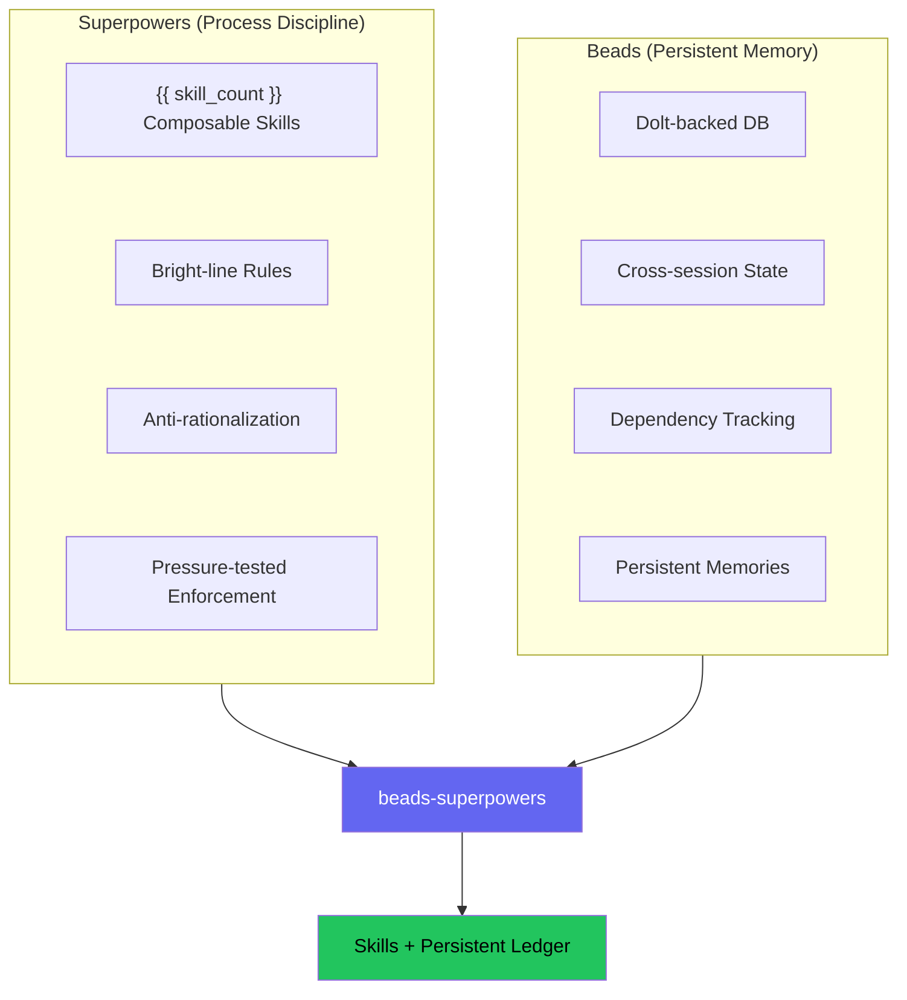
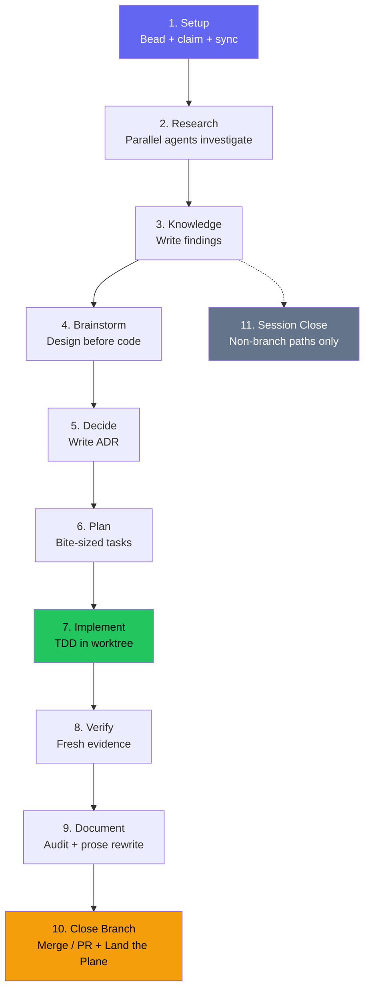

# Methodology

## The problem

Ask an AI coding agent to build a feature and watch what happens. It skips straight to code, writes implementation before tests, claims the work is "done" without running verification, and if you point out a problem it agrees instantly rather than pushing back. Start a new session the next day and every task it was tracking has vanished.

Two projects attacked each half of this.

### Process discipline

[Superpowers](https://github.com/obra/superpowers) (Jesse Vincent) shipped 14 composable skills that force agents to brainstorm before coding, write tests before implementation, investigate root causes before proposing fixes, and verify before claiming completion. The skills use bright-line rules — "NO PRODUCTION CODE WITHOUT A FAILING TEST FIRST" — rather than hedged guidance like "consider writing tests", because compliance doubles from 33% to 72% when instructions are absolute rather than suggested (Meincke et al. 2025). Each skill includes an anti-rationalization table that preempts the excuses agents use to skip steps.

### Persistent memory

Superpowers tracked tasks with `TodoWrite`, which vanishes when a session ends. [Beads](https://github.com/gastownhall/beads) (Steve Yegge) replaced that with a Dolt-backed issue tracker where every task is a bead with a hash-based ID that survives session boundaries. Beads handles dependency tracking, cell-level merges for conflict-free multi-agent work, a full audit trail via the events table, and `bd remember` for persistent learnings. At every session start, `bd prime` injects the current task state so the agent picks up where it left off.

### The gap

Superpowers enforced good process but forgot everything between sessions. Beads remembered everything but imposed no process on how work should be done. beads-superpowers connects the two: every process step in every skill creates, updates, or closes a persistent bead, so following the right process and maintaining persistent memory are the same action.

## How it works

The plugin installs {{ skill_count }} composable skills and a Dolt-backed task database. A `using-superpowers` bootstrap skill loads at session start and routes the agent to whichever skill fits the current task.

The first change was mechanical: every `TodoWrite` call across the original 14 Superpowers skills was replaced with the equivalent `bd` command.

| Before (TodoWrite) | After (Beads) |
|--------------------|---------------|
| `TodoWrite("Task 1: Implement login")` | `bd create "Task 1: Implement login" -t task --parent <epic-id>` |
| Mark task as in_progress | `bd update <task-id> --claim` |
| Mark task as completed | `bd close <task-id> --reason "Implemented login"` |
| "More tasks remain?" | `bd ready --parent <epic-id>` |

The replacement works at two levels. Execution skills track plan tasks as beads. Checklist-heavy skills like brainstorming (9 steps) and writing-skills (20 steps) create a bead for each internal step. Both levels persist, because if checklist tracking is ephemeral while task tracking is persistent, agents learn that some tracking is optional.

Subsequent changes went further:

**Prompt template pattern.** Subagent definitions moved from standalone agent files into prompt templates owned by the skills that dispatch them (`implementer-prompt.md`, `researcher-prompt.md`). One source of truth per subagent role — no drift between the skill's expectations and the subagent's instructions.

**Parallel batch mode.** When `bd ready --parent` returns multiple unblocked tasks, `subagent-driven-development` executes them concurrently (max 5 per batch), each in its own `bd worktree`.

**Dynamic Context Injection.** The `research-driven-development` skill uses Claude Code's `!` backtick syntax to resolve its output directory at skill load time, with per-project config, environment variable, or default fallback.

**Mid-session enforcement.** A `UserPromptSubmit` hook fires on every user message, injecting skill trigger reminders that prevent the agent from forgetting to invoke skills as the session progresses.

**Orchestrator-only design.** Only the orchestrating agent creates, claims, and closes beads. Subagents focus on their job. The one exception is `implementer-prompt.md`, which is beads-aware by design — it includes bead lifecycle commands, mandatory skill invocations, and LSP-first code navigation.

**Safety-aware worktree creation.** The `using-git-worktrees` skill now runs pre-flight checks before creating worktrees: environment detection (`GIT_DIR` vs `GIT_COMMON`) catches nested-worktree-from-worktree mistakes, a submodule guard prevents worktree creation in submodule contexts where git's shared `.git` pointer breaks, and a conditional consent flow asks the user before creating worktrees in manual contexts while skipping the prompt during automated SDD execution.

**Environment-aware branch finishing.** `finishing-a-development-branch` detects whether the agent is in a normal repository, a named-branch worktree, or a detached HEAD, and adapts the option menu accordingly — 4 choices in normal and worktree contexts, 3 for detached HEAD where merge is impossible. Provenance-based cleanup only removes worktrees inside `.worktrees/`, leaving externally created worktrees untouched.

**Template-only code review dispatch.** The standalone `agents/code-reviewer.md` file was removed. Code review now dispatches through the prompt template at `skills/requesting-code-review/code-reviewer.md`, matching upstream superpowers v5.1.0. One source of truth per subagent role, consistent with the prompt template pattern already used for the implementer and researcher.

**Atomic beads operations.** Skills that create multiple beads in sequence — epics with child tasks and dependency chains — can now use `bd batch` to run the whole set as a single transaction. If any operation fails, the entire batch rolls back, preventing orphaned beads from partial failures.

## The lifecycle

A non-trivial feature request moves through up to 10 states. Simple tasks skip research and planning (S2–S6) but still pass through the quality pipeline (S7–S10). S11 (Session Close) fires only on non-branch paths like research queries.

**Step 1 — Setup.** Every task begins with a bead. Before any research or code, the work is captured (`bd create`), claimed (`bd update --claim`), and synced. If the session dies, the bead record shows an in-progress item that can be recovered.

**Step 2 — Research.** The `research-driven-development` skill dispatches two agents in parallel: a researcher investigates the problem domain while an `@explore` agent maps the affected code. Running both concurrently cuts research time roughly in half.

**Step 3 — Knowledge capture.** Findings are written to a persistent document. Key learnings go into `bd remember` so they surface in future sessions.

**Step 4 — Brainstorming.** The `brainstorming` skill walks through context, clarifying questions, 2–3 approaches with trade-offs, and a design spec committed to git. It ends by invoking `writing-plans` — not by jumping to code. The `stress-test` skill may fire here to interrogate the design adversarially.

**Step 5 — Decision capture.** Architecture decisions become ADRs in `decisions/` — explicit, timestamped records with context, rationale, and consequences.

**Step 6 — Planning.** `writing-plans` breaks the design into bite-sized tasks (2–5 minutes each) with exact file paths, code, and verification steps. Every task becomes a bead.

**Step 7 — Implementation.** Code runs in an isolated git worktree under TDD. The orchestrator creates an epic with task children and dependency chains, then dispatches implementer subagents. When multiple tasks are unblocked, parallel batch mode runs up to 5 concurrently, each in its own worktree. After each task, a spec reviewer and code quality reviewer run in sequence — the bead closes only after both pass.

**Step 8 — Verification.** The full test suite runs fresh — not relying on the last run during development. "Tests pass" means a test command was just executed and its output is attached.

**Step 9 — Documentation.** `document-release` scans the diff against existing docs for stale references, missing entries, and outdated examples. When the audit flags sections needing major prose rewrites, `write-documentation` fires for those sections.

**Step 10 — Close branch.** `finishing-a-development-branch` detects the current environment — normal repository, named-branch worktree, or detached HEAD — and presents context-aware options: 4 choices for normal and worktree contexts, 3 for detached HEAD where merge is unavailable. Provenance-based cleanup only removes worktrees inside `.worktrees/`, leaving externally created worktrees alone. The skill ends with the Land the Plane protocol: `bd close` → `bd dolt push` → `git push` → `git status`. Branch paths terminate here — work is not done until both task state and code reach the remote.

**Step 11 — Session close.** Fires only on non-branch paths (research queries, quick tasks that didn't create a branch). Runs the same close ritual as Step 10's Land the Plane: close beads, push to remotes, verify clean state. The next session runs `bd prime` to restore the full picture.

## Agent memory

Because beads tracks every process step, the memory types agents need are populated as a side effect of following the workflow. 17 of {{ skill_count }} skills now prompt for `bd remember` at their natural completion points — root causes after debugging, design decisions after brainstorming, review insights after code review — so memory capture happens within the skill workflow, not as a separate step.

| Memory Type | Beads Feature | What it answers |
|-------------|---------------|-----------------|
| Working | `bd show --current` | What am I doing right now? |
| Short-term | `bd list --status=in_progress` | What's active? |
| Long-term | `bd remember` + `bd prime` | What did I learn last week? |
| Procedural | `bd formula` | How do I do this kind of task? |
| Episodic | `events` table | What happened and when? |
| Semantic | `bd search`, `bd query` | Where's the related work? |
| Prospective | `bd ready` | What should I do next? |

## Research basis

### Cialdini (2021) — Influence principles

Three principles from *Influence: The Psychology of Persuasion* shape how skills are written. Authority: Iron Laws use absolute phrasing because agents treat authoritative instructions as harder to override. Consistency: once an agent begins a skill's process, consistency pressure keeps it on track through the remaining steps. Scarcity: phrasing like "you cannot rationalize your way out of this" removes the sense that alternatives exist.

### Meincke et al. (2025) — Absolute vs hedged instructions

Compliance doubled from 33% to 72% when AI agents received absolute rules instead of hedged guidance. Pre-emptive rationalization counters outperformed reactive correction. Specific examples of non-compliance were more effective than generic warnings. These findings explain the structure of every discipline-enforcing skill: an Iron Law (absolute, no exceptions), a Red Flags table (anticipated rationalizations with counter-arguments), and bright-line rules (MUST/NEVER rather than "consider" or "prefer").

### TDD applied recursively

The `writing-skills` meta-skill revealed that TDD principles apply to process documentation itself:

| TDD Concept | Skill Creation Equivalent |
|-------------|--------------------------|
| Test case | Pressure scenario with subagent |
| Production code | Skill document (SKILL.md) |
| RED | Agent violates rule without skill (baseline) |
| GREEN | Agent complies with skill present |
| Refactor | Close loopholes while maintaining compliance |

Every rule in every skill has been verified through adversarial pressure testing, not designed from theory alone.

### Claude Search Optimization (CSO)

An empirical finding: when a skill's YAML `description` field summarized the workflow ("code review between tasks"), Claude followed the description instead of reading the full skill content and did one review instead of the two the skill specified. As a result, every skill's `description` is a trigger condition ("when to use this"), not a workflow summary ("what this does"), which forces the full content to be read.

## Design decisions

**Plugin subsumes beads hooks.** Beads' `bd setup claude` installs hooks that run `bd prime`. The plugin also needs to inject skill context. Rather than fire both and waste 3–4k tokens on redundant context, the plugin's hook does both jobs and warns if the standalone hooks are still installed.

**Land the Plane in the branch skill.** The session close protocol lives in `finishing-a-development-branch` (Step 6) rather than a separate skill. Branch paths terminate at S10, which includes the full push ritual. Non-branch paths (research queries) use S11 (SESSION_CLOSE) for the same ritual without the branch decision tree.

**Template-only agent dispatch.** Code review was the last subagent dispatched via a standalone agent file (`agents/code-reviewer.md`). In v0.6.0 the file was removed and the reviewer dispatches through its skill's prompt template, matching the implementer and researcher. All subagent definitions now live inside the skills that use them.

**Skills are Markdown, not code.** Following Superpowers' zero-dependency philosophy, all skills are plain Markdown with YAML frontmatter. No build step. The only runtime dependency is `bd`, which is optional — skills still work without it, they just lose persistence.

## Sources

- [obra/superpowers](https://github.com/obra/superpowers) v5.1.0 — 14 composable skills for AI agents (MIT)
- [gastownhall/beads](https://github.com/gastownhall/beads) v1.0.4 — Persistent issue tracker for AI agents (MIT)
- Cialdini, R. B. (2021). *Influence: The Psychology of Persuasion* (New and Expanded Edition). Harper Business.
- Meincke, L., et al. (2025). AI agent compliance with explicit vs hedged instructions. Referenced in `skills/writing-skills/persuasion-principles.md`.
