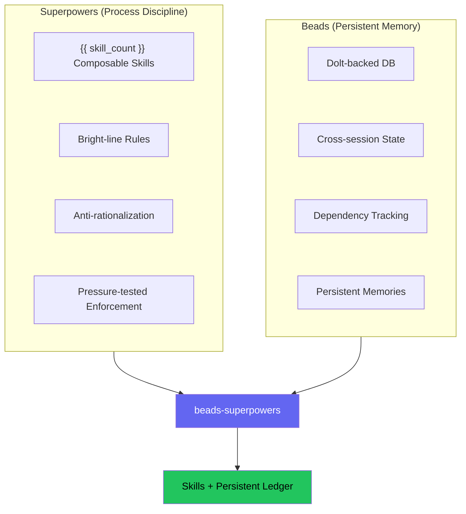
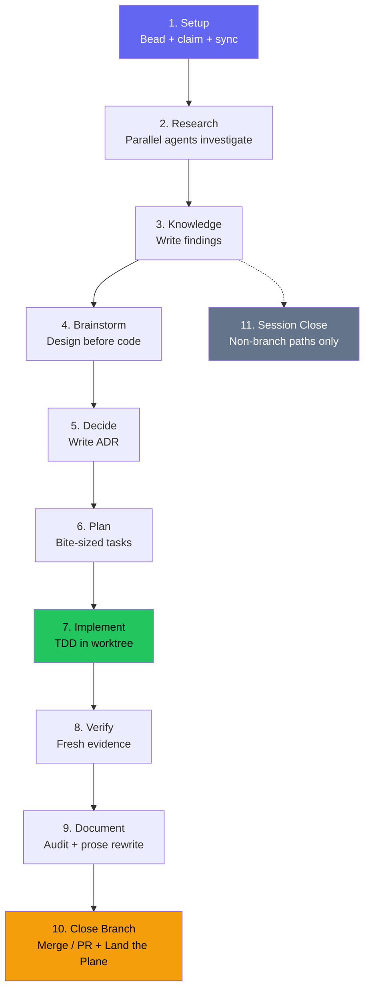

!!! warning "机器翻译"
    本页面由 AI 自动翻译，可能存在术语或语义偏差。如有疑问，请以[英文原文](methodology.md)为准。

# 方法论

## 问题

让一个 AI 编程智能体构建一个功能，看看会发生什么。它直接跳到代码，先写实现再写测试，声称工作"完成"却不运行验证，你指出问题时它立刻同意而不是反驳。第二天开始新的会话时，它追踪的所有任务都消失了。

两个项目分别解决了各自的问题。

### 流程规范

[Superpowers](https://github.com/obra/superpowers)（Jesse Vincent）发布了14个可组合技能，强制智能体在编码前进行 brainstorming、在实现前编写测试、在提出修复建议前调查根本原因、在声称完成前进行验证。这些技能使用严格规则——"在没有失败测试的情况下，绝不编写生产代码"——而非模糊的建议如"考虑编写测试"，因为当指令是绝对的而非建议性的时，合规率从33%翻倍提升到72%（Meincke et al. 2025）。每个技能都包含一个反合理化表格，预先消除智能体用来跳过步骤的借口。

### 持久记忆

Superpowers 使用 `TodoWrite` 追踪任务，但会话结束后这些记录就会消失。[Beads](https://github.com/gastownhall/beads)（Steve Yegge）将其替换为 Dolt 支持的问题追踪器，每个任务都是一个具有基于哈希 ID 的 bead，能够跨越会话边界持久存在。Beads 处理依赖追踪、无冲突多智能体工作的单元级合并、通过 events 表实现的完整审计追踪，以及通过 `bd remember` 持久化学习成果。在每次会话开始时，`bd prime` 注入当前任务状态，使智能体从上次中断的地方继续。

### 差距

Superpowers 强制执行良好流程，但会话之间会遗忘所有内容。Beads 记住所有内容，但对工作方式没有强制流程。beads-superpowers 将两者连接起来：每个技能中的每个流程步骤都会创建、更新或关闭一个持久 bead，因此遵循正确流程和维护持久记忆是同一个动作。

## 工作原理

该插件安装 {{ skill_count }} 个可组合技能和一个 Dolt 支持的任务数据库。`using-superpowers` 引导技能在会话开始时加载，并将智能体路由到适合当前任务的技能。

第一个变化是机械性的：将原始14个 Superpowers 技能中的每个 `TodoWrite` 调用替换为等效的 `bd` 命令。

| Before (TodoWrite) | After (Beads) |
|--------------------|---------------|
| `TodoWrite("Task 1: Implement login")` | `bd create "Task 1: Implement login" -t task --parent <epic-id>` |
| Mark task as in_progress | `bd update <task-id> --claim` |
| Mark task as completed | `bd close <task-id> --reason "Implemented login"` |
| "More tasks remain?" | `bd ready --parent <epic-id>` |

替换在两个层面有效。执行技能将计划任务作为 bead 追踪。像 brainstorming（9个步骤）和 writing-skills（20个步骤）这样的检查表密集型技能为每个内部步骤创建一个 bead。两个层面都需要持久化，因为如果检查表追踪是短暂的而任务追踪是持久的，智能体就会认为某些追踪是可选的。

后续变化更进一步：

**生产级规范。** 现在每个会话都有一条常设指令，要求将工作视为面向真实用户的生产级别，无论任务看起来多么微小——"这只是个脚本"这种合理化思维会产生最糟糕的缺陷。智能体不得自行走捷径、悄悄删减需求或接受有重大影响的权衡，也绝不削弱或移除安全控制。有正当理由的例外需提交用户决定；安全回退则直接拒绝。该规则在 `using-superpowers` 中只存在一次，由 session-start 钩子在每次会话时完整注入，门控技能——brainstorming、stress-test、代码审查和完成检查——在实际做出这些决定时引用它。

**提示词模板模式。** 子智能体定义从独立的智能体文件移入由调度它们的技能拥有的提示词模板（`implementer-prompt.md`、`researcher-prompt.md`）。每个子智能体角色只有一个真相来源——技能期望与子智能体指令之间不会产生偏差。

**并行批处理模式。** 当 `bd ready --parent` 返回多个未被阻塞的任务时，`subagent-driven-development` 并发执行这些任务（每批最多5个），每个任务在其自己的 `bd worktree` 中运行。

**仅编排者设计。** 只有编排智能体创建、认领和关闭 bead。子智能体专注于自己的工作。唯一的例外是 `implementer-prompt.md`，它在设计上具有 beads 感知——包含 bead 生命周期命令、强制技能调用和 LSP 优先的代码导航。

## 生命周期

一个复杂的功能请求最多经历10个状态。简单任务跳过研究和规划（S2–S6），但仍然通过质量流水线（S7–S10）。S11（会话关闭）仅在研究查询等非分支路径上触发。

**步骤1——设置。** 每个任务都从一个 bead 开始。在任何研究或代码之前，工作被捕获（`bd create`）、认领（`bd update --claim`）并同步。如果会话中断，bead 记录显示一个可以恢复的进行中项目。

**步骤2——研究。** `research-driven-development` 技能将主题分解为子问题，并为每个子问题并行调度一个研究员——另外还有一个 `@explore` 智能体，当主题涉及代码库时映射受影响的代码。并发运行这些智能体大幅缩短研究时间，每个智能体为每个关键主张返回逐字引用，以便结果可以与来源进行验证。

**步骤3——知识捕获。** 发现被写入持久文档；关键学习成果存入 `bd remember`，以便在未来会话中浮现。

**步骤4——Brainstorming。** `brainstorming` 技能依次处理上下文、澄清问题、2–3个带有权衡的方法，以及提交到 git 的设计规格说明。它通过调用 `writing-plans` 结束——而不是直接跳到代码。规格说明审查门每次都提供 `stress-test`，在规划前对设计进行对抗性审查。

**步骤5——决策捕获。** 当一个选择难以撤销、脱离上下文令人意外且是真实权衡的结果时，智能体会提议将其记录为 `decisions/` 中的架构决策记录（Architecture Decision Record）——一个包含上下文、决策、理由和后果的带时间戳的说明。这些是识别标志，而非可借故跳过的清单：当某个决策大体符合时，智能体倾向于提议记录而非略过，只有常规澄清和范围确认才排除在外。该规则在 `using-superpowers` 中只存在一次，并在实际做出决策的地方被引用：brainstorming、规划、stress-test 以及调试会话中的转折点。

**步骤6——规划。** `writing-plans` 将设计分解为小粒度任务（每个2–5分钟），包含精确的文件路径、代码和验证步骤。每个任务都成为一个 bead。

**步骤7——实现。** 代码在 TDD 约束下的隔离 git worktree 中运行。编排者创建一个包含任务子项和依赖链的 epic，然后调度实现者子智能体。当多个任务未被阻塞时，并行批处理模式并发运行最多5个，每个在其自己的 worktree 中。每个任务完成后，一个只读审查者在单次传递中返回规格说明合规判决和代码质量判决；bead 仅在审查通过后关闭。任务说明、实现者报告和审查差异作为每个 worktree 的 `.internal/sdd/` 目录下的文件在各阶段之间传递，保持编排者的上下文精简。

**步骤8——验证。** 完整测试套件重新运行——不依赖开发过程中的上次运行。"测试通过"意味着测试命令刚刚执行完毕且输出已附上。

**步骤9——文档。** `document-release` 扫描差异与现有文档的对比，查找过时引用、缺失条目和过时示例。当审计标记需要大量散文重写的部分时，`write-documentation` 对这些部分触发。

**步骤10——关闭分支。** `finishing-a-development-branch` 检测当前环境——普通仓库、命名分支 worktree 或游离 HEAD——并呈现上下文感知选项：普通和 worktree 上下文有4个选择，游离 HEAD（无法合并）有3个选择。基于来源的清理只删除 `.worktrees/` 内的 worktree，不影响外部创建的 worktree。该技能以 Land the Plane 协议结束：若本次会话产生了多条新记忆，先提供一次 `memory-curator` 整理再执行 `bd dolt push`；随后 `bd close` → `bd dolt push` → `git push` → `git status`。分支路径在此终止——直到任务状态和代码都到达远端，工作才算完成。

**步骤11——会话关闭。** 仅在非分支路径（研究查询、未创建分支的快速任务）上触发。运行与步骤10 Land the Plane 相同的关闭仪式：关闭 bead、若本次会话产生了多条新记忆则提供一次 `memory-curator` 整理、推送到远端、验证干净状态。下一个会话运行 `bd prime` 以恢复完整状态。

## 智能体记忆

由于 beads 追踪每个流程步骤，智能体所需的记忆类型作为遵循工作流的副作用而填充。{{ skill_count }} 个技能中的大多数现在在其自然完成点提示 `bd remember`——调试后的根本原因、brainstorming 后的设计决策、代码审查后的审查洞察——因此记忆捕获发生在技能工作流内，而不是作为单独步骤。

| 记忆类型 | Beads 功能 | 它回答什么 |
|----------|-----------|-----------|
| 工作记忆 | `bd show --current` | 我现在在做什么？ |
| 短期记忆 | `bd list --status=in_progress` | 什么在进行中？ |
| 长期记忆 | `bd remember` + `bd prime` | 我上周学到了什么？ |
| 程序记忆 | 技能检查表 + `bd ready` | 我如何完成这类任务？ |
| 情节记忆 | `events` 表 | 发生了什么以及何时发生？ |
| 语义记忆 | `bd search`、`bd query` | 相关工作在哪里？ |
| 前瞻记忆 | `bd ready` | 我接下来应该做什么？ |

`memory-curator` 技能会整合、去重并修剪 `bd remember` 积累的记忆库——在会话关闭时若捕获了多条新记忆则提供，或可随时按需调用。

## 研究基础

### Cialdini (2021) — 影响力原则

《影响力：说服心理学》（*Influence: The Psychology of Persuasion*）中的三个原则塑造了技能的写作方式。权威性：铁律使用绝对性措辞，因为智能体将权威指令视为更难覆盖的规则。一致性：一旦智能体开始一个技能的流程，一致性压力使其在剩余步骤中保持正轨。稀缺性：像"你无法为此找到合理借口"这样的措辞消除了存在替代方案的感觉。

### Meincke et al. (2025) — 绝对指令与模糊指令

当 AI 智能体接收绝对规则而非模糊指导时，合规率从33%翻倍提升到72%。预防性反合理化反驳优于反应性纠正。具体的违规示例比泛泛的警告更有效。这些发现解释了每个执行纪律的技能的结构：铁律（绝对，无例外）、红旗表格（预期合理化借口及反驳）和严格规则（MUST/NEVER 而非"考虑"或"倾向于"）。

### TDD 的递归应用

`writing-skills` 元技能揭示了 TDD 原则适用于流程文档本身：

| TDD 概念 | 技能创建等价物 |
|---------|-------------|
| 测试用例 | 与子智能体的压力场景 |
| 生产代码 | 技能文档（SKILL.md） |
| RED | 智能体在没有技能的情况下违反规则（基线） |
| GREEN | 智能体在技能存在时合规 |
| Refactor | 在保持合规的同时关闭漏洞 |

每个技能中的每条规则都通过对抗性压力测试进行了验证，而不仅仅是从理论设计出来的。

### 技能发现优化（SDO）

一个实证发现：当技能的 YAML `description` 字段总结工作流（"任务间的代码审查"）时，智能体会遵循描述而不是阅读完整的技能内容，并跳过完整技能指定的步骤。因此，每个技能的 `description` 是触发条件（"何时使用"），而不是工作流摘要（"这做什么"），这迫使完整内容被阅读。

## 设计决策

**插件接管 beads 钩子。** Beads 的 `bd setup claude` 安装运行 `bd prime` 的钩子。插件也需要注入技能上下文。与其同时触发两者并在冗余上下文上浪费3–4k tokens，插件的钩子承担两项工作，并在独立钩子仍然安装时发出警告。

**Land the Plane 在分支技能中。** 会话关闭协议位于 `finishing-a-development-branch`（步骤6）而非单独的技能中。分支路径在S10终止，包含完整的推送仪式。非分支路径（研究查询）使用S11（SESSION_CLOSE）执行相同仪式，但不包含分支决策树。

**仅模板智能体调度。** 代码审查是最后一个通过独立智能体文件（`agents/code-reviewer.md`）调度的子智能体。在v0.6.0中该文件被移除，审查者通过其技能的提示词模板调度，与实现者和研究员保持一致。所有子智能体定义现在都位于使用它们的技能内部。

**技能是 Markdown，而非代码。** 遵循 Superpowers 的零依赖哲学，所有技能都是带 YAML 前置元数据的纯 Markdown。无需构建步骤。唯一的运行时依赖是 `bd`，它是可选的——技能在没有它的情况下仍然有效，只是失去了持久性。

## 来源

- [obra/superpowers](https://github.com/obra/superpowers) v6.1.1 — 适用于 AI 智能体的可组合技能（MIT）
- [gastownhall/beads](https://github.com/gastownhall/beads) v1.1.0 — 适用于 AI 智能体的持久化问题追踪器（MIT）
- Cialdini, R. B. (2021). *Influence: The Psychology of Persuasion*（新增扩展版）. Harper Business.
- Meincke, L., et al. (2025). AI 智能体对明确指令与模糊指令的合规性研究。参见 `skills/writing-skills/persuasion-principles.md`。
