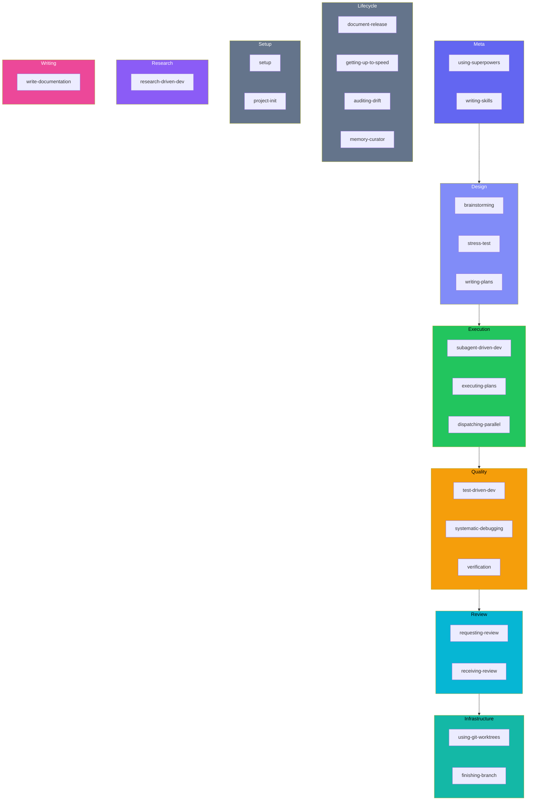
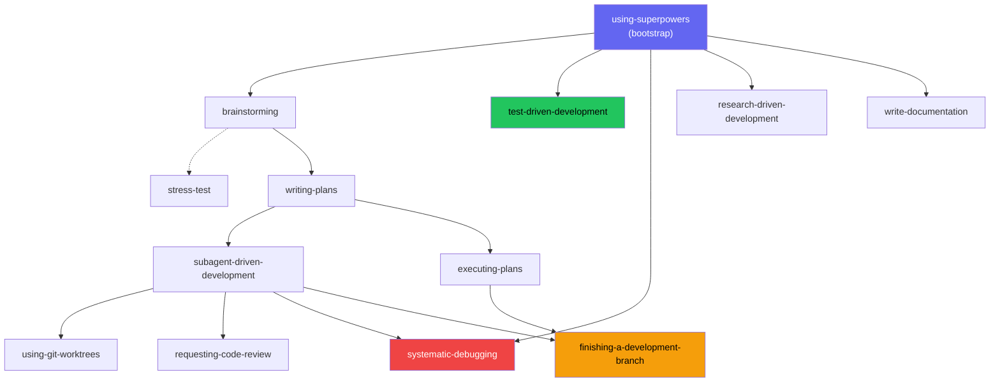

# Skills Reference

beads-superpowers ships {{ skill_count }} composable skills loaded on demand via the `Skill` tool. The bootstrap skill `using-superpowers` loads at every session start and routes to the right skill for the current task. Skills are mandatory — when one applies, the agent must invoke it.

## Trigger map

The UserPromptSubmit hook reminds the agent on every message which skill applies to which task:

| Task | Skill |
|---|---|
| Bug or test failure | `systematic-debugging` |
| Writing code | `test-driven-development` |
| New feature or design | `brainstorming` |
| Stress-test a design | `stress-test` |
| Writing a plan | `writing-plans` |
| Executing a plan | `subagent-driven-development` / `executing-plans` |
| Research question | `research-driven-development` |
| Complex task (6+ files) | `using-git-worktrees` |
| About to claim done | `verification-before-completion` |
| Code review needed | `requesting-code-review` |
| Received review feedback | `receiving-code-review` |
| Writing human-facing prose | `write-documentation` |
| Branch complete | `finishing-a-development-branch` |
| Consolidate or dedup memories | `memory-curator` |

Also available: `document-release`, `getting-up-to-speed`, `dispatching-parallel-agents`, `project-init`, `setup`, `writing-skills`, `auditing-upstream-drift`

## By category

| Category | Skills |
|---|---|
| **Meta** | [using-superpowers](#using-superpowers), [writing-skills](#writing-skills) |
| **Design** | [brainstorming](#brainstorming), [writing-plans](#writing-plans), [stress-test](#stress-test) |
| **Execution** | [subagent-driven-development](#subagent-driven-development), [executing-plans](#executing-plans), [dispatching-parallel-agents](#dispatching-parallel-agents) |
| **Quality** | [test-driven-development](#test-driven-development), [systematic-debugging](#systematic-debugging), [verification-before-completion](#verification-before-completion) |
| **Review** | [requesting-code-review](#requesting-code-review), [receiving-code-review](#receiving-code-review) |
| **Infrastructure** | [using-git-worktrees](#using-git-worktrees), [finishing-a-development-branch](#finishing-a-development-branch) |
| **Lifecycle** | [document-release](#document-release), [getting-up-to-speed](#getting-up-to-speed), [auditing-upstream-drift](#auditing-upstream-drift), [memory-curator](#memory-curator) |
| **Setup** | [setup](#setup), [project-init](#project-init) |
| **Research** | [research-driven-development](#research-driven-development) |
| **Writing** | [write-documentation](#write-documentation) |

## All skills

### using-superpowers

Bootstrap skill injected at every session start. Routes the agent to the correct skill for the current task, and carries the production-grade doctrine that holds every session to a no-shortcuts, no-silent-descope, never-a-security-regression standard. It also carries the decision-capture convention: when a choice is hard to reverse, surprising, and a genuine trade-off, the agent offers to record an ADR in `decisions/`. All other skills depend on this one having loaded first.

### writing-skills

Meta-skill for creating and modifying skills. Enforces TDD-for-process-docs: new skills need a failing test before the SKILL.md is written. Frontmatter descriptions must be trigger conditions, not workflow summaries (see SDO in [Methodology](methodology.md)).

### brainstorming

**Trigger:** Before any creative work — features, components, or behavior changes.

Socratic design exploration. Asks structured questions to surface requirements, constraints, and design alternatives. Produces a committed design spec. Ends by invoking `writing-plans`, not by jumping to code.

### writing-plans

**Trigger:** When you have a spec or requirements for a multi-step task.

Breaks a design into bite-sized tasks (2–5 minutes each) with exact file paths, code, and verification steps. Every task becomes a bead with dependency ordering.

### stress-test

**Trigger:** When a design or plan needs adversarial scrutiny. Also triggers on "grill me", "poke holes", "challenge this design".

Interrogates every branch of the decision tree with recommended answers and structured `AskUserQuestion` responses (Agree / Disagree / Discuss further). Tracks branch resolution progress, writes findings inline (Mode A) or to a standalone report (Mode B), and runs a reflexion self-review before closing. Typically runs between brainstorming and writing-plans.

### subagent-driven-development

**Trigger:** When executing a plan with independent tasks.

Dispatches a fresh subagent per task with a single read-only task review between tasks — one reviewer returns a spec-compliance verdict and a code-quality verdict in one pass. The orchestrator tracks beads; subagents don't touch them. When multiple tasks are unblocked, **parallel batch mode** runs up to 5 concurrently, each in its own worktree.

### executing-plans

**Trigger:** When executing a plan in a single session with review checkpoints.

Runs a multi-phase plan sequentially: claim, implement, verify against acceptance criteria, close, next phase. Designed to complement `writing-plans` output directly.

### dispatching-parallel-agents

**Trigger:** When facing 2+ independent tasks without shared state.

Coordinates concurrent subagents for independent work — plan tasks, subsystem changes, anything without shared mutable state. Used by SDD's parallel batch mode for the dispatch pattern.

### test-driven-development

**Trigger:** Before writing any implementation code.

Iron Law: no production code without a failing test first — explicit failing-test output required before touching any implementation. RED-GREEN-REFACTOR, no shortcuts.

### systematic-debugging

**Trigger:** Any bug, test failure, or unexpected behavior — before proposing fixes.

Four-phase root cause analysis: observe, hypothesize, isolate, fix. Requires a confirmed root cause before any code change. Blocks "just try this and see."

### verification-before-completion

**Trigger:** Before claiming work is done, fixed, or passing.

The agent must run verification commands and show actual output — not assert from memory — before closing a bead or creating a PR. Evidence before assertions.

### requesting-code-review

**Trigger:** After completing tasks, major features, or before merging.

Dispatches a code reviewer subagent that checks the diff against the original requirements, reporting strengths, issues grouped by severity, and an overall assessment. The reviewer gets the original requirements alongside the diff.

### receiving-code-review

**Trigger:** When review feedback arrives, especially if unclear or questionable.

Anti-sycophancy protocol: requires technical evaluation of each suggestion rather than blind acceptance, with disagreements escalated explicitly.

### using-git-worktrees

**Trigger:** Feature work needing isolation, or before executing plans.

Creates and manages isolated git worktrees via `bd worktree`. Pre-flight checks detect existing worktree isolation, submodule contexts, and prompt for consent (skipped when SDD-dispatched). Supports multiple concurrent worktrees for parallel subagent work — one per task, max 5. Use `bd -C .worktrees/<name>` for cross-worktree commands.

### finishing-a-development-branch

**Trigger:** Implementation complete, tests pass, ready to integrate.

Detects environment (normal repo, named-branch worktree, or detached HEAD) and adapts options — 4 choices for normal/worktree, 3 for detached HEAD (no merge). Provenance-based cleanup only removes `.worktrees/` paths. Ends with the mandatory Land the Plane sequence: `bd close` → `bd dolt push` → `git push`.

### document-release

**Trigger:** After code changes are committed, before PR merge.

Walks through README, CHANGELOG, CLAUDE.md, CONTRIBUTING, and other docs to find and fix drift against shipped code. A coverage map catches docs that are missing entirely — a new flag or command with no reference page — not only stale ones, and each CHANGELOG entry is scored against a what-changed, why-care, how-to-use test.

### getting-up-to-speed

**Trigger:** Session start, after compaction, or "catch me up" / "where are we".

Runs `bd prime`, deep-dives the codebase (adaptive to repo size), and produces a structured current-state summary. A pre-emit verification gate holds every claim in that summary to a command actually run in the session, and a beads-versus-git check flags work that shipped but was left open.

### auditing-upstream-drift

**Trigger:** Before a plugin release, or when checking for staleness.

Audits against [obra/superpowers](https://github.com/obra/superpowers) and [gastownhall/beads](https://github.com/gastownhall/beads) for new skills, changed commands, and documentation improvements to port.

### memory-curator

**Trigger:** At session-close when several new memories were captured, or on-demand for a full sweep.

Turns a session's raw `bd remember` notes into well-structured, deduplicated, consolidated memories using the in-session agent — no runtime, key, or embeddings. The scope is deliberately evidence-led (ADR-0034): quality-gated capture, reflection-consolidation, and pruning, not structural richness. It never mutates the store silently — it proposes a reviewed command list, and you approve before anything is written.

### setup

**Trigger:** After npx install, or when skills aren't activating.

Registers the SessionStart hook in `.claude/settings.json` so skills activate automatically. The plugin's session-start hook automatically detects `bd setup claude` hooks and skips duplicate `bd prime` calls.

### project-init

**Trigger:** When `bd` commands fail, setting up beads in a new project, or recovering from diverged Dolt history.

Three paths: fresh init, bootstrap from remote, or recovery when Dolt history has diverged.

### research-driven-development

**Trigger:** Research questions, "what is X", "how does Y work", "compare A vs B".

Decomposes the topic into sub-questions, dispatches one researcher per sub-question in parallel (plus `@explore` for codebase-relevant topics), verifies each load-bearing claim against a verbatim source quote, and synthesizes findings into a persistent document with per-finding confidence. Iron Law: no research without a document — verbal answers without persistent artifacts are prohibited.

### write-documentation

**Trigger:** Writing or rewriting human-facing prose — docs, guides, emails, PR descriptions, release notes.

14-rule writing system adapted from [WRITING.md](https://github.com/Anbeeld/WRITING.md). Context-first drafting, required checks as revision pass, targets the patterns that make LLM prose recognizable (regularity, catalog prose, false crispness). Pairs with `document-release` (which handles *when* to update, not *how* to write).

## Beads commands

Skills use `bd` commands to track work. Only the orchestrating agent manages beads — subagents don't touch them.

| Action | Command | Used in |
|---|---|---|
| Create epic | `bd create "Epic: name" -t epic` | SDD, executing-plans |
| Create task | `bd create "Task: name" -t task --parent <epic>` | SDD, executing-plans |
| Quick capture | `bd q "title"` | any skill |
| Claim work | `bd update <id> --claim` | executing-plans |
| Complete work | `bd close <id> --reason "why"` | all execution skills |
| Check remaining | `bd ready --parent <epic>` | SDD, executing-plans |
| Compound query | `bd query "status=open AND priority<=1"` | getting-up-to-speed (replaces `bd list` + jq) |
| Grouped counts | `bd count --by-status` | getting-up-to-speed (also `--by-priority`/`--by-type`) |
| Add dependency | `bd dep add <child> <parent>` | SDD, writing-plans |
| Store learning | `bd remember "insight"` | 21 of {{ skill_count }} skills prompt for this |
| Attach evidence | `bd note <id> "context"` | verification |
| Explain dependencies | `bd ready --explain` | systematic-debugging, executing-plans |
| Atomic batch ops | `bd batch` (stdin) | SDD, executing-plans, finishing-branch |
| Cross-worktree ops | `bd -C <path> <cmd>` | using-git-worktrees, SDD |
| Lint issue sections | `bd lint [id...]` | writing-plans (self-review) |
| Defer work | `bd defer <id> --until="<date>"` | executing-plans |
| Flag for human decision | `bd human <id>` | executing-plans |
| Validate parallel readiness | `bd swarm validate <epic>` | SDD (parallel batch) |
| Sync to remote | `bd dolt push` | finishing-a-development-branch |

## How skills chain

Edges show direct skill-to-skill invocations only — transitions managed by the orchestrator (e.g., verification → document-release → finishing) are omitted. Dashed edges are optional. Skills like `systematic-debugging`, `verification-before-completion`, and `receiving-code-review` fire whenever their trigger is met, regardless of workflow position.
