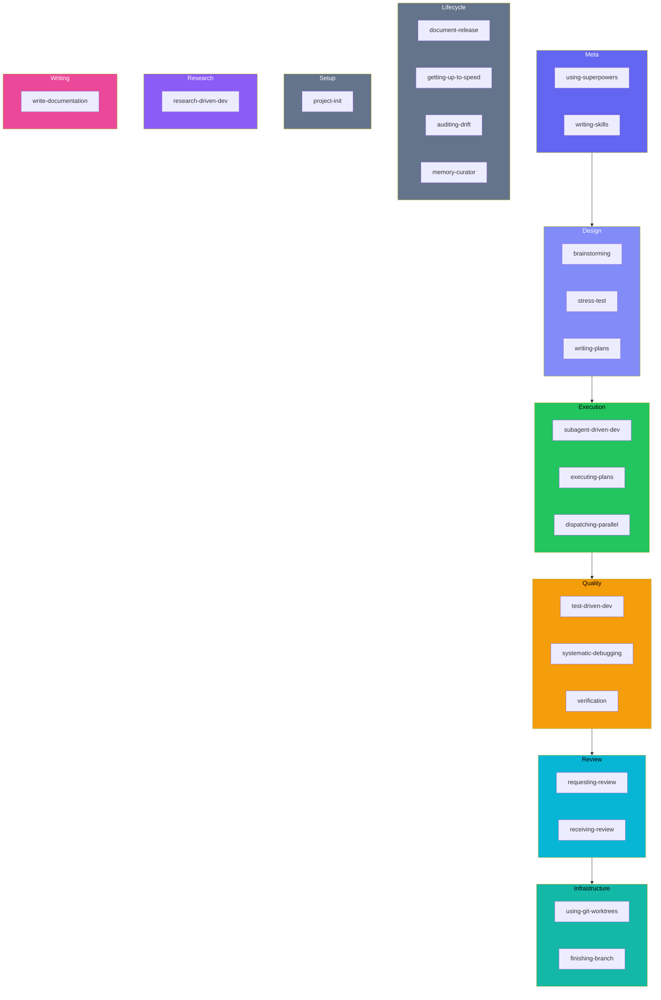
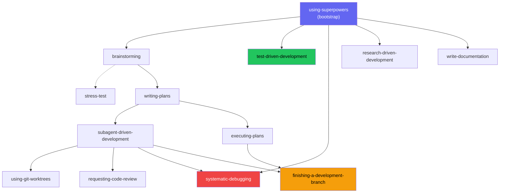

!!! warning "机器翻译"
    本页面由 AI 自动翻译，可能存在术语或语义偏差。如有疑问，请以[英文原文](skills.md)为准。

# 技能参考

beads-superpowers 附带 {{ skill_count }} 个可组合技能，通过 `Skill` 工具按需加载。引导技能 `using-superpowers` 在每次会话开始时加载，并将请求路由至适合当前任务的技能。技能为强制性要求——当某个技能适用时，智能体必须调用它。

## 触发映射

在会话开始时注入的 `using-superpowers` 引导技能会告知智能体哪个技能适用于哪个任务：

| 任务 | 技能 |
|---|---|
| Bug 或测试失败 | `systematic-debugging` |
| 编写代码 | `test-driven-development` |
| 新功能或设计 | `brainstorming` |
| 对设计进行压力测试 | `stress-test` |
| 编写计划 | `writing-plans` |
| 执行计划 | `subagent-driven-development` / `executing-plans` |
| 研究性问题 | `research-driven-development` |
| 复杂任务（6+ 个文件） | `using-git-worktrees` |
| 即将声明完成 | `verification-before-completion` |
| 需要代码审查 | `requesting-code-review` |
| 收到审查反馈 | `receiving-code-review` |
| 编写面向用户的文本 | `write-documentation` |
| 分支完成 | `finishing-a-development-branch` |
| 整合或去重记忆 | `memory-curator` |
| 将工作移交至下一会话 | `session-handoff`（人工调用） |

其他可用技能：`document-release`、`getting-up-to-speed`、`dispatching-parallel-agents`、`project-init`、`writing-skills`、`auditing-upstream-drift`

## 按类别

| 类别 | 技能 |
|---|---|
| **元** | [using-superpowers](#using-superpowers), [writing-skills](#writing-skills) |
| **设计** | [brainstorming](#brainstorming), [writing-plans](#writing-plans), [stress-test](#stress-test) |
| **执行** | [subagent-driven-development](#subagent-driven-development), [executing-plans](#executing-plans), [dispatching-parallel-agents](#dispatching-parallel-agents) |
| **质量** | [test-driven-development](#test-driven-development), [systematic-debugging](#systematic-debugging), [verification-before-completion](#verification-before-completion) |
| **审查** | [requesting-code-review](#requesting-code-review), [receiving-code-review](#receiving-code-review) |
| **基础设施** | [using-git-worktrees](#using-git-worktrees), [finishing-a-development-branch](#finishing-a-development-branch) |
| **生命周期** | [document-release](#document-release), [getting-up-to-speed](#getting-up-to-speed), [auditing-upstream-drift](#auditing-upstream-drift), [memory-curator](#memory-curator), [session-handoff](#session-handoff) |
| **设置** | [project-init](#project-init) |
| **研究** | [research-driven-development](#research-driven-development) |
| **写作** | [write-documentation](#write-documentation) |

## 所有技能

### using-superpowers

在每次会话开始时注入的引导技能。将智能体路由至当前任务对应的正确技能，并承载生产级行为规范，确保每个会话遵循无捷径、无静默缩减范围、永不引入安全回归的标准。它还承载决策捕获约定：当某个选择难以撤销、出乎意料且存在真实权衡时，智能体会提议在 `decisions/` 中记录一条 ADR。其他所有技能都依赖于此技能先行加载。

### writing-skills

用于创建和修改技能的元技能。强制执行面向过程文档的 TDD：新技能在编写 SKILL.md 之前需要一个失败的测试。Frontmatter 描述必须是触发条件，而非工作流摘要（参见 [方法论](methodology.md) 中的 SDO）。

### brainstorming

**触发条件：** 任何创意性工作之前——功能、组件或行为变更。

苏格拉底式设计探索。通过结构化提问来挖掘需求、约束条件和设计备选方案。产出已提交的设计规格说明。以调用 `writing-plans` 结束，而非直接跳转到代码。

### writing-plans

**触发条件：** 当你拥有多步骤任务的规格说明或需求时。

将设计分解为小粒度任务（每个 2–5 分钟），附带精确的文件路径、代码和验证步骤。每个任务都会成为一个带有依赖排序的 bead。

### stress-test

**触发条件：** 当设计或计划需要对抗性审视时。也可通过"grill me"、"poke holes"、"challenge this design"触发。

针对决策树的每个分支进行审问，提供推荐答案和结构化的多选响应（同意 / 不同意 / 进一步讨论）。跟踪分支解决进度，将发现结果内联写入（模式 A）或写入独立报告（模式 B），并在关闭前执行反思式自我审查。通常在 brainstorming 和 writing-plans 之间运行。

### subagent-driven-development

**触发条件：** 当执行包含独立任务的计划时。

为每个任务派发一个新的子智能体，任务之间进行单次只读任务审查——一个审查者在一轮中返回规格说明合规判定和代码质量判定。编排者跟踪 bead；子智能体不接触它们。当多个任务解除阻塞时，**并行批处理模式**最多并发运行 5 个，每个在各自的 worktree 中运行。

### executing-plans

**触发条件：** 当在单个会话中执行带有审查检查点的计划时。

按顺序运行多阶段计划：认领、实现、根据验收标准进行验证、关闭、下一阶段。专为直接配合 `writing-plans` 输出而设计。

### dispatching-parallel-agents

**触发条件：** 当面临 2 个或更多无共享状态的独立任务时。

协调并发子智能体执行独立工作——计划任务、子系统变更，以及任何无共享可变状态的工作。被 SDD 的并行批处理模式用于分发模式。

### test-driven-development

**触发条件：** 在编写任何实现代码之前。

铁律：没有失败的测试就不能编写生产代码——在接触任何实现之前，必须提供明确的失败测试输出。RED-GREEN-REFACTOR，无捷径。

### systematic-debugging

**触发条件：** 任何 bug、测试失败或意外行为——在提出修复方案之前。

四阶段根本原因分析：观察、假设、隔离、修复。在进行任何代码变更之前，需要确认根本原因。杜绝"试一试看看"的做法。

### verification-before-completion

**触发条件：** 在声明工作已完成、已修复或已通过之前。

智能体在关闭 bead 或创建 PR 之前，必须运行验证命令并展示实际输出——而非凭记忆断言。断言之前先出示证据。

### requesting-code-review

**触发条件：** 完成任务、主要功能之后，或合并之前。

派发代码审查子智能体，对照原始需求检查差异，报告优点、按严重程度分组的问题和总体评估。审查者在获得差异的同时也收到原始需求。

### receiving-code-review

**触发条件：** 当审查反馈到达时，尤其是在反馈不清晰或存疑时。

反谄媚协议：要求对每条建议进行技术评估，而非盲目接受，并明确升级处理分歧。

### using-git-worktrees

**触发条件：** 需要隔离的功能工作，或在执行计划之前。

通过 `bd worktree` 创建和管理隔离的 git worktree。预检查检测现有的 worktree 隔离、子模块上下文，并提示征得同意（当由 SDD 派发时跳过）。支持用于并行子智能体工作的多个并发 worktree——每个任务一个，最多 5 个。使用 `bd -C .worktrees/<name>` 执行跨 worktree 命令。

### finishing-a-development-branch

**触发条件：** 实现完成、测试通过、准备集成。

检测环境（普通仓库、命名分支 worktree 或游离 HEAD），并调整选项——普通/worktree 模式 4 个选项，游离 HEAD 模式 3 个选项（无合并）。基于来源的清理仅移除 `.worktrees/` 路径。以强制性的 Land the Plane 序列结束：`bd close` → `bd dolt push` → `git push`。

### document-release

**触发条件：** 代码变更提交后、PR 合并前。

遍历 README、CHANGELOG、CLAUDE.md、CONTRIBUTING 及其他文档，查找并修复与已发布代码之间的偏差。覆盖率地图不仅能捕获过时的文档，还能发现完全缺失的文档——例如没有参考页面的新标志或命令——并对每条 CHANGELOG 条目按"变更了什么、为何值得关注、如何使用"进行评分。

### getting-up-to-speed

**触发条件：** 会话开始、压缩后，或"catch me up"/"where are we"。

通过一次 `orient.sh` 调用收集 beads 状态与最新交接文档，深入研究代码库（子智能体的并行扇出按仓库规模分级：`<40` / `40–150` / `>150` 个被跟踪文件），并生成结构化的当前状态摘要。它会将最新的 `.internal/handoff/` 文档（由其对应技能 `session-handoff` 写入）作为未读收件箱读取，纳入摘要后在结束时归档，以免后续会话重复读取；当 `HEAD` 已越过该文档记录的提交时，HEAD 时效性回退机制会将其标记为可能过时。预发布验证门将摘要中的每个声明都与会话中实际运行的命令相对应，beads 与 git 的对比检查会标记已发布但仍处于开放状态的工作，并在结束时清理被取代的 `continuation-*` 记忆。

### auditing-upstream-drift

**触发条件：** 插件发布前，或检查过时情况时。

对照 [obra/superpowers](https://github.com/obra/superpowers) 和 [gastownhall/beads](https://github.com/gastownhall/beads) 进行审计，检查需要移植的新技能、已变更的命令和文档改进。

### memory-curator

**触发时机：** 会话结束时已捕获多条新记忆，或按需进行全量整理。

将会话中原始的 `bd remember` 笔记，通过会话内智能体转化为结构良好、去重整合后的记忆——无需运行时环境、密钥或嵌入向量。其范围刻意以证据为导向：质量把关的捕获、反思式整合与修剪，而非追求结构丰富性。它绝不会静默修改记忆库——它会提出一份经过审查的命令列表，由你确认后才写入。

### project-init

**触发条件：** 当 `bd` 命令失败、在新项目中设置 Beads，或从分叉的 Dolt 历史中恢复时。

三条路径：全新初始化、从远端引导，或在 Dolt 历史分叉时进行恢复。

### research-driven-development

**触发条件：** 研究性问题、"what is X"、"how does Y work"、"compare A vs B"。

将主题分解为子问题，并行为每个子问题派发一名研究者（以及针对代码库相关主题的 `@explore`），对照逐字来源引用验证每个关键性声明，并将发现综合到带有每条发现置信度的持久性文档中。铁律：没有文档就没有研究——禁止给出没有持久性制品的口头答案。

### write-documentation

**触发条件：** 编写或改写面向用户的文本——文档、指南、电子邮件、PR 描述、发布说明。

改编自 [WRITING.md](https://github.com/Anbeeld/WRITING.md) 的 14 条写作规则体系。以上下文优先起草，将必要检查作为修订轮次，针对使 LLM 文本易于识别的模式（规律性、目录式文本、虚假简洁）。与 `document-release` 配合使用（后者处理*何时*更新，而非*如何*写作）。

### session-handoff

**仅限人工调用。** 生成一份基于实证的交接文档，并存储 `bd remember` 续接记忆，使下一会话无需依赖聊天记录即可接续进行中的工作。

## Beads 命令

技能使用 `bd` 命令跟踪工作。只有编排智能体管理 bead——子智能体不接触它们。

| 操作 | 命令 | 使用于 |
|---|---|---|
| 创建史诗 | `bd create "Epic: name" -t epic` | SDD, executing-plans |
| 创建任务 | `bd create "Task: name" -t task --parent <epic>` | SDD, executing-plans |
| 原子化计划创建 | `bd create --graph plan.json [--dry-run]` | writing-plans, SDD |
| 快速捕获 | `bd q "title"` | 任意技能 |
| 认领工作 | `bd update <id> --claim` | executing-plans |
| 完成工作 | `bd close <id> --reason "why"` | 所有执行类技能 |
| 检查剩余 | `bd ready --parent <epic>` | SDD, executing-plans |
| 复合查询 | `bd query "status=open AND priority<=1"` | getting-up-to-speed（替代 `bd list` + jq） |
| 分组计数 | `bd count --by-status` | getting-up-to-speed（也可用 `--by-priority`/`--by-type`） |
| 添加依赖 | `bd dep add <child> <parent>` | SDD, writing-plans |
| 存储学习 | `bd remember "insight"` | {{ skill_count }} 个技能中的大多数会提示执行此操作 |
| 附加证据 | `bd note <id> "context"` | verification |
| 解释依赖 | `bd ready --explain` | systematic-debugging, executing-plans |
| 同步到远端 | `bd dolt push` | finishing-a-development-branch |

!!! info "深入了解 — 上游 Beads 文档"
    - [CLI 参考](https://gastownhall.github.io/beads/cli-reference) — 超出上表工作流核心集的完整 `bd` 命令（`batch`、`lint`、`defer`、`human`、`swarm`、`-C` 等）

## 技能链式调用

边仅显示技能对技能的直接调用——由编排者管理的过渡（例如，verification → document-release → finishing）已省略。虚线边为可选调用。`systematic-debugging`、`verification-before-completion` 和 `receiving-code-review` 等技能，只要满足其触发条件，无论处于工作流的哪个位置都会触发。
