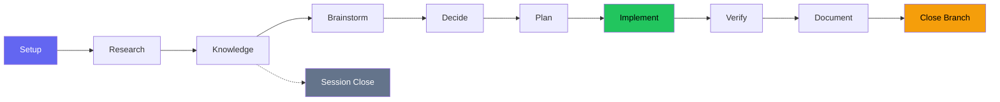
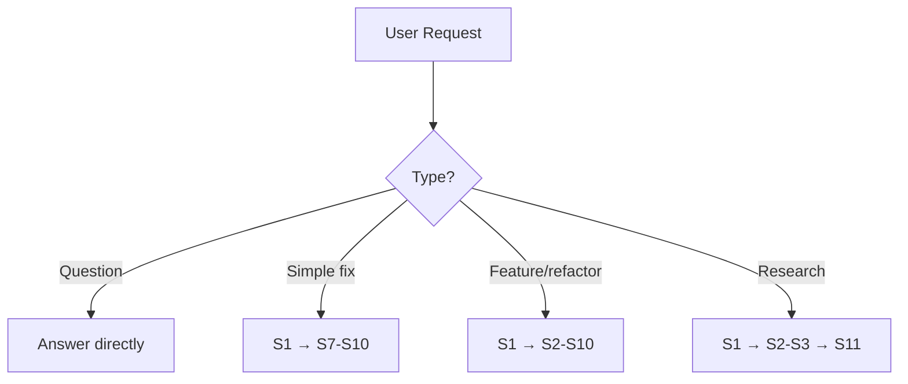
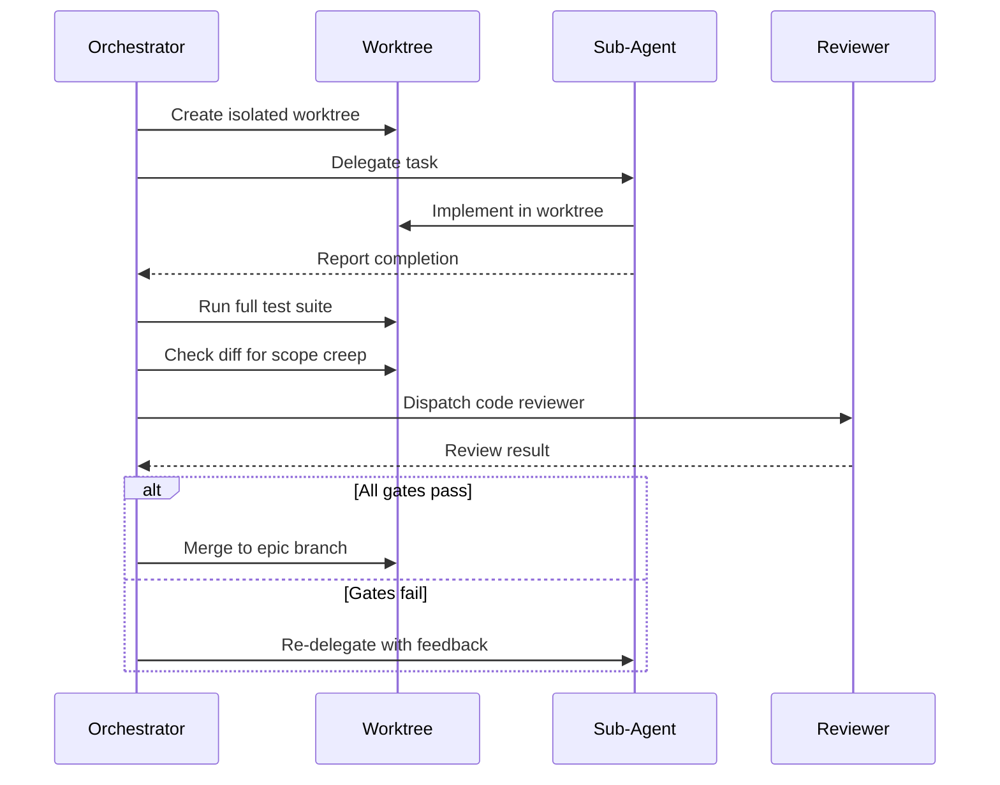

# Example Workflow

How beads-superpowers skills orchestrate a development lifecycle through an 11-state FSM.

Want to use this workflow? Grab the [example-workflow/](https://github.com/DollarDill/beads-superpowers/tree/main/example-workflow) directory — it has a ready-to-use CLAUDE.md and the [yegge.md](https://github.com/DollarDill/beads-superpowers/blob/main/example-workflow/agents/yegge.md) orchestrator agent.

## The FSM

S1–S6 scale with complexity — a typo fix goes straight from S1 to S7. S7–S10 run for every code change. S11 (Session Close) fires only on non-branch paths like research queries.

## Triage

Every request is classified before entering the FSM:

| Type | Examples | Path |
|---|---|---|
| Quick question | "What does this file do?" | Answer directly, no FSM |
| Simple task | "Fix this typo" | S1 → S7–S10 |
| Non-trivial task | "Add a new feature" | S1–S10 (full) |
| Research query | "How does X work?" | S1 → S2–S3 → S11 |

Complexity scales the research and planning depth (S2–S6), not the quality gates (S7–S10).

## States

### S1 — Setup

Create bead (`bd create`), claim it (`bd update --claim`), sync remote (`bd dolt pull`). If the session dies, the bead record shows in-progress work that can be recovered.

### S2 — Research

`research-driven-development` dispatches a researcher subagent and an `@explore` agent in parallel. One investigates the problem domain, the other maps affected code and dependencies. If one fails, the other's findings are enough to proceed.

### S3 — Knowledge capture

Synthesize research into a persistent document. Store key learnings with `bd remember`. Forces a coherence check — contradictions between researcher and explorer surface here, not during implementation.

### S4 — Brainstorm

`brainstorming` explores the solution space through structured questions, surfaces assumptions, and produces a design spec committed to git. The design must be user-approved before moving forward. `stress-test` may fire here to interrogate the design adversarially.

### S5 — Decision capture

Write an ADR in `decisions/` — context, decision, consequences, alternatives considered. Transforms implicit brainstorming decisions into explicit records.

### S6 — Plan

`writing-plans` decomposes the design into bite-sized tasks (2–5 min each) with exact file paths, code, and verification steps. Every task becomes a bead. Plan must be user-approved. No "TBD" or "as needed" — every step is concrete or the plan isn't ready.

### S7 — Implement

Code runs in an isolated worktree under TDD (red-green-refactor). The orchestrator creates an epic bead with task children and dependency chains, then dispatches implementer subagents.

Before creating the worktree, the skill runs pre-flight checks: it verifies the agent isn't already inside a worktree and isn't in a submodule, and asks for consent when the creation is user-initiated rather than SDD-automated.

When multiple tasks are unblocked, **parallel batch mode** runs up to 5 concurrently, each in its own worktree. Sequential mode runs one at a time when tasks have dependencies.

Every subagent result passes through the [review gate](#review-gate) before being accepted. Dependency chains between tasks use `bd batch` for atomic wiring — if any dependency fails to register, the whole batch rolls back rather than leaving orphaned state.

### S8 — Verify

`verification-before-completion` runs the full test suite fresh — not relying on the last run during development. "Tests pass" means a test command was just executed and its output is attached.

### S9 — Document

`document-release` scans the diff against existing docs for stale references, missing entries, and outdated examples. When the audit flags sections needing major prose rewrites, `write-documentation` fires for those sections.

### S10 — Close branch

`finishing-a-development-branch` detects the environment (normal repo, named-branch worktree, or detached HEAD) and presents context-aware options — 4 choices for normal/worktree, 3 for detached HEAD (merge is unavailable). Provenance-based cleanup only removes worktrees inside `.worktrees/`. Ends with the Land the Plane protocol: close beads, push to remotes, verify clean state. Branch paths terminate here — work is not done until both `bd dolt push` and `git push` succeed.

### S11 — Session close

Fires only on non-branch paths (research queries, quick tasks that didn't create a branch). Runs the same close ritual as S10's Land the Plane: `bd close` → `bd dolt push` → `git push` → `git status`. The next session runs `bd prime` to restore the full picture.

## Review gate

When SDD delegates to a subagent, the result passes through four checks before being accepted:

1. **Test suite** — Run independently in the worktree. The subagent's own test run is not sufficient.
2. **Diff review** — Check for scope creep. Changes not in the plan are grounds for rejection.
3. **Code review** — `requesting-code-review` verifies spec compliance against acceptance criteria.
4. **Acceptance criteria** — Each criterion from the plan is explicitly verified.

A subagent reporting "done" is a claim, not evidence. The gate converts the claim into evidence.

## Interrupts

Two interrupt states can fire at any point in the FSM. They suspend the current state, handle the interrupt, and return.

**DEBUG** — Fires on bugs, test failures, or unexpected behavior. `systematic-debugging` enforces a 4-phase investigation (observe → hypothesize → investigate → fix) before any code change. Prevents jumping from "tests fail" to "try this fix" without understanding why.

**CODE REVIEW** — Fires when review feedback arrives. `receiving-code-review` enforces anti-sycophantic reception: evaluate each suggestion technically, surface disagreements explicitly, track changes made in response.

## Session protocol

**Start:** The SessionStart hook fires automatically, injecting skill context and running `bd prime`. This surfaces unblocked beads, in-progress work from previous sessions, and persistent memories. Orient first, claim second, implement third.

**End:** S10 (Close Branch) for code paths, S11 (Session Close) for non-branch paths. Close all beads with evidence, push beads remote, push git, verify clean state. A session with uncommitted work or unpushed commits has not landed — the push is the definition of completion.
