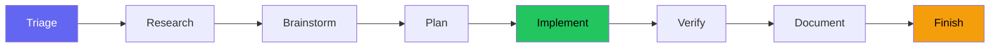
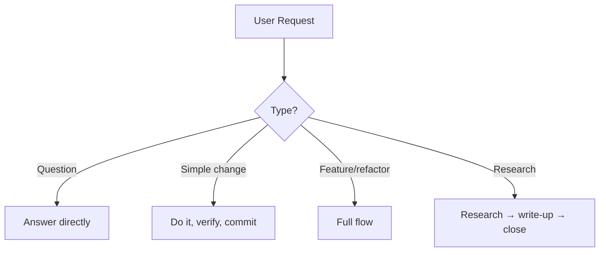
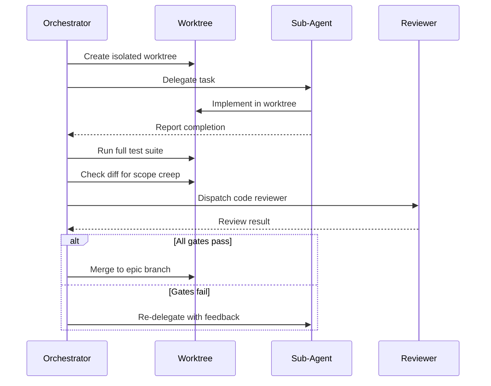

# Example Workflow

How beads-superpowers skills orchestrate a development lifecycle. The `yegge` orchestrator triages each request and routes it to the skills that own each step; for non-trivial work it runs the full flow below and lets each skill enforce its own gates. It is a router, not a state machine — nothing is gated by an unenforceable "no step may be skipped" rule.

Want to use this workflow? Grab the [example-workflow/](https://github.com/DollarDill/beads-superpowers/tree/main/example-workflow) directory — it has a ready-to-use CLAUDE.md and the [yegge.md](https://github.com/DollarDill/beads-superpowers/blob/main/example-workflow/agents/yegge.md) orchestrator agent. The orchestrator is an optional add-on — install it globally with `install.sh --with-yegge` (it is not installed by default), or copy `agents/yegge.md` into your project manually.

## The flow

Research, brainstorming, and planning scale with complexity — a typo fix skips straight to the implement-verify-finish tail. The quality steps (implement, verify, document, finish) run for every code change. Verification is required on every path, including the lightest one.

## Triage

Every request is classified first, and the classification decides how much process it gets:

| Type | Examples | Path |
|---|---|---|
| Quick question | "What does this file do?" | Answer directly, no bead |
| Simple change | "Fix this typo" | Do it directly, verify, commit — no worktree or PR |
| Non-trivial | "Add a new feature" | The full flow |
| Research query | "How does X work?" | Research, write the findings, done |

Complexity scales the research and planning depth, not the quality gates. A simple change still gets verified; it just skips the worktree, the doc audit, and the PR ceremony.

## The steps

### Setup

Create a bead (`bd create`), claim it (`bd update --claim`), and sync the beads DB (`bd dolt pull` when a remote is configured). If the session dies, the bead record shows the in-progress work so the next session can recover it.

### Research

`research-driven-development` decomposes the topic into sub-questions and dispatches one researcher per sub-question in parallel — with an `@explore` agent mapping affected code and dependencies when the topic is codebase-relevant. The orchestrator then verifies each load-bearing claim against the verbatim quote its researcher returned, and runs one capped gap-closing round if any claim rests on a single source.

### Knowledge capture

Synthesize the research into a persistent document and store key learnings with `bd remember`. This forces a coherence check: contradictions between what the researcher and the explorer found surface here, not midway through implementation.

### Brainstorm

`brainstorming` explores the solution space through structured questions, surfaces assumptions, and produces a design spec committed to git. The design must be user-approved before anything moves forward, and the spec-review gate offers a `stress-test` every time to interrogate it adversarially.

### Decision capture

When a choice is hard to reverse, surprising without its context, and a real trade-off, the agent offers to record an ADR in `decisions/` — context, decision, consequences, alternatives considered. The agent leans toward offering whenever a decision plausibly fits these marks; only routine clarifications and scope calls fall outside. It turns an implicit decision into an explicit record a later reader can trace.

### Plan

`writing-plans` breaks the design into bite-sized tasks (2–5 minutes each) with exact file paths, code, and verification steps, and every task becomes a bead. The plan must be user-approved. There is no "TBD" or "as needed" — every step is concrete, or the plan isn't ready.

### Implement

Code runs in an isolated worktree under TDD (red-green-refactor). The orchestrator creates an epic bead with task children and dependency chains, then dispatches implementer subagents.

Before creating the worktree, the skill runs pre-flight checks: it confirms the agent isn't already inside a worktree or a submodule, and asks for consent when a human, rather than the SDD automation, kicked it off.

When several tasks are unblocked, **parallel batch mode** runs up to five concurrently, each in its own worktree; sequential mode runs one at a time when tasks depend on each other. Every subagent result passes through the [review gate](#review-gate) before it's accepted, and the initial epic, tasks, and dependency graph are created atomically with `bd create --graph`; `bd batch` handles subsequent close, dep-add, and update operations.

!!! info "Go deeper — upstream Beads docs"
    - [Multi-agent coordination](https://gastownhall.github.io/beads/multi-agent) — the tool-level primitives beneath parallel batch mode

### Verify

`verification-before-completion` runs the full test suite fresh, rather than trusting the last run during development. "Tests pass" means a test command was just executed and its output is attached. This holds on every path, the light one included.

### Document

`document-release` scans the diff against the existing docs for stale references, missing entries, and outdated examples. When the audit flags a section that needs a real prose rewrite, `write-documentation` takes that section.

### Finish

`finishing-a-development-branch` detects the environment — normal repo, named-branch worktree, or detached HEAD — and presents context-aware options: four choices for normal and worktree contexts, three for detached HEAD, where merging is unavailable. Provenance-based cleanup only removes worktrees inside `.worktrees/`. It ends with the Land the Plane protocol: close beads, push to the remotes, verify a clean tree. Branch work isn't done until both `bd dolt push` and `git push` succeed.

### Session close

On non-branch paths — research queries, quick tasks that never created a branch — the same close ritual runs without the merge step: `bd close` → `bd dolt push` → `git push` → `git status`. If the session produced several new memories, the orchestrator offers a `memory-curator` pass before `bd dolt push`. The next session's start-hook injection restores the full picture.

## Review gate

When SDD delegates to a subagent, the result passes through four checks before it's accepted:

1. **Test suite** — Run independently in the worktree. The subagent's own test run is not enough.
2. **Diff review** — Check for scope creep. Changes that aren't in the plan are grounds for rejection.
3. **Code review** — `requesting-code-review` verifies spec compliance against the acceptance criteria.
4. **Acceptance criteria** — Each criterion from the plan is verified explicitly.

A subagent reporting "done" is a claim, not evidence. The gate is what turns the claim into evidence.

## Interrupts

Two interrupts can fire at any point. They suspend the current step, handle the interrupt, and return.

**Debug** — Fires on bugs, test failures, or unexpected behavior. `systematic-debugging` enforces a four-phase investigation (observe → hypothesize → investigate → fix) before any code change, so you don't jump from "tests fail" to "try this fix" without understanding why.

**Code review** — Fires when review feedback arrives. `receiving-code-review` enforces anti-sycophantic reception: evaluate each suggestion technically, surface disagreements explicitly, and track what actually changed in response.

## Session protocol

**Start:** The SessionStart hook fires automatically, injecting skill context plus a composed beads context — a `bd` command pointer and the highest-salience persistent memories. Run `bd ready` to surface unblocked beads and in-progress work from previous sessions. Orient before claiming; claim before implementing.

**End:** Finish for code paths, Session close for non-branch paths. Close every bead with evidence; if the session produced several new memories, offer a `memory-curator` pass before the push. Push the beads remote, push git, verify a clean tree. A session with uncommitted work or unpushed commits hasn't landed — the push is what completion means.
