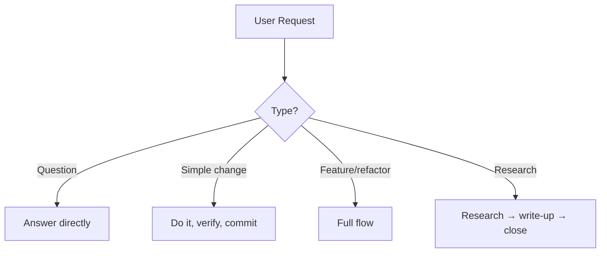
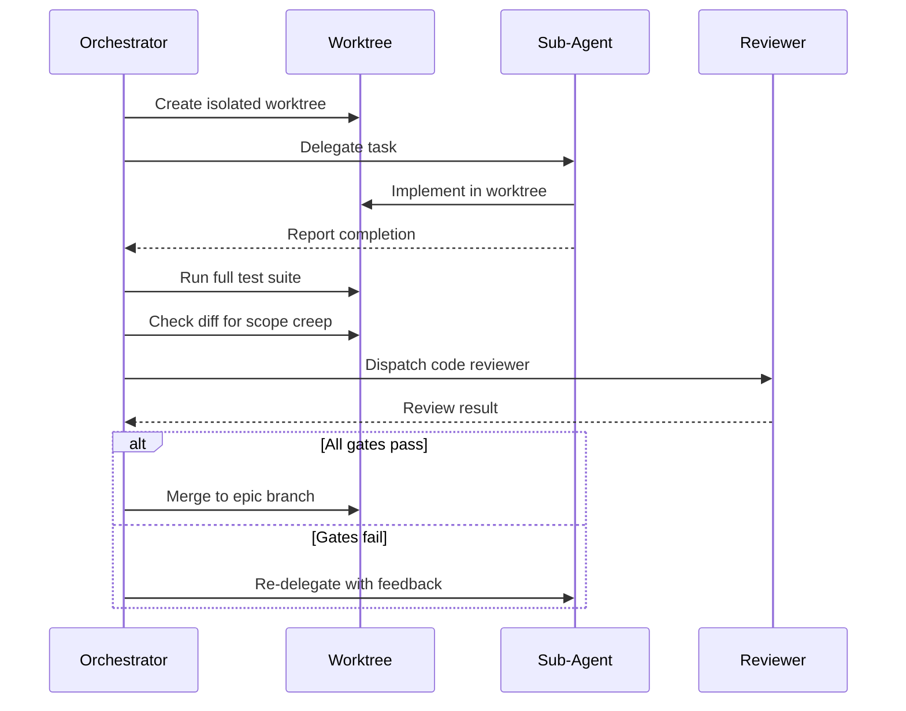

!!! warning "机器翻译"
    本页面由 AI 自动翻译，可能存在术语或语义偏差。如有疑问，请以[英文原文](workflow.md)为准。

# 示例工作流

beads-superpowers 技能如何编排开发生命周期。`yegge` 编排器对每个请求进行分类，并将其路由到负责每个步骤的技能；对于非简单工作，它执行以下完整流程，让每个技能执行自己的门控。它是一个路由器，而非状态机——没有任何规则是靠不可执行的"不可跳过某步骤"约束来保证的。

想使用此工作流？获取 [example-workflow/](https://github.com/DollarDill/beads-superpowers/tree/main/example-workflow) 目录——它包含一个即用的 CLAUDE.md 和 [yegge.md](https://github.com/DollarDill/beads-superpowers/blob/main/example-workflow/agents/yegge.md) 编排器智能体。

## 流程

研究、brainstorming 和计划会根据复杂度进行扩展——修复一个错别字可以直接跳到实现-验证-完成的尾部。质量步骤（实现、验证、文档、完成）在每次代码变更时都会执行。验证在每条路径上都是必须的，包括最轻量的路径。

## 分类（Triage）

每个请求首先进行分类，分类结果决定其所需流程的多少：

| 类型 | 示例 | 路径 |
|---|---|---|
| 快速问题 | "这个文件是做什么的？" | 直接回答，不创建 bead |
| 简单修改 | "修复这个错别字" | 直接操作，验证，提交——无需 worktree 或 PR |
| 非简单任务 | "添加新功能" | 完整流程 |
| 研究查询 | "X 是如何工作的？" | 研究，撰写发现，完成 |

复杂度决定研究和计划的深度，而非质量门控。简单修改仍需验证；只是跳过了 worktree、文档审计和 PR 流程。

## 各步骤

### 初始化（Setup）

创建一个 bead（`bd create`），认领它（`bd update --claim`），并同步 Beads 数据库（如果配置了远程，则执行 `bd dolt pull`）。如果会话中断，bead 记录会显示进行中的工作，以便下一个会话恢复。

### 研究（Research）

`research-driven-development` 将主题分解为子问题，并为每个子问题并行派发一个研究者智能体——当主题与代码库相关时，还会有一个 `@explore` 智能体映射受影响的代码和依赖关系。编排器随后对每个关键性声明与其研究者返回的逐字引用进行验证，如果某个声明仅依赖单一来源，则运行一轮有限的差距弥补。

### 知识捕获（Knowledge capture）

将研究成果综合为一份持久化文档，并用 `bd remember` 存储关键学习成果。这强制进行一致性检查：研究者和探索者之间的矛盾在这里浮现，而不是在实现过程中途才发现。

### 头脑风暴（Brainstorm）

`brainstorming` 通过结构化问题探索解决方案空间，梳理假设，并生成提交到 git 的设计规格说明。设计必须经过用户批准才能继续，规格说明审查门控每次都提供 `stress-test` 选项以进行对抗性审查。

### 决策捕获（Decision capture）

当一个选择难以逆转、离开上下文令人困惑、且存在真实权衡时，智能体会提出在 `decisions/` 目录中记录一条 ADR——包含背景、决策、后果和已考虑的替代方案。三部分门控使记录保持精简，避免将例行澄清变成正式记录。它将隐式决策转化为后续读者可以追溯的显式记录。

### 计划（Plan）

`writing-plans` 将设计拆分为小粒度任务（每项 2–5 分钟），包含精确的文件路径、代码和验证步骤，每个任务都成为一个 bead。计划必须经过用户批准。没有"待定"或"视需而定"——每个步骤都是具体的，否则计划尚未就绪。

### 实现（Implement）

代码在隔离的 worktree 中以 TDD（red-green-refactor）模式运行。编排器创建一个带有子任务和依赖链的 epic bead，然后派发实现者子智能体。

在创建 worktree 之前，技能会运行预检：确认智能体未处于 worktree 或子模块内部，并在由人工而非 SDD 自动化启动时请求确认。

当多个任务处于未阻塞状态时，**并行批处理模式**最多并发运行五个任务，每个任务在自己的 worktree 中；当任务之间存在依赖时，顺序模式每次运行一个任务。每个子智能体的结果在被接受前都必须经过[审查门控](#review-gate)，依赖链通过 `bd batch` 原子性地建立——如果某个依赖注册失败，整个批次将回滚，而不是留下孤立状态。

### 验证（Verify）

`verification-before-completion` 重新运行完整测试套件，而不是信任开发过程中的上次运行。"测试通过"意味着刚刚执行了测试命令并附有其输出。这适用于每条路径，包括最轻量的那条。

### 文档（Document）

`document-release` 扫描 diff 与现有文档，查找过时的引用、缺失的条目和过时的示例。当审计标记出需要真正重写散文的部分时，`write-documentation` 负责该部分。

### 完成（Finish）

`finishing-a-development-branch` 检测环境——普通仓库、命名分支 worktree 或分离 HEAD——并提供上下文感知的选项：普通和 worktree 上下文提供四个选项，分离 HEAD 提供三个（合并不可用）。基于来源的清理仅移除 `.worktrees/` 内的 worktree。最后执行 Land the Plane 协议：关闭 bead，推送到远程，验证干净的工作树。在 `bd dolt push` 和 `git push` 都成功之前，分支工作未完成。

### 会话关闭（Session close）

在非分支路径上——研究查询、从未创建分支的快速任务——相同的收尾流程在没有合并步骤的情况下运行：`bd close` → `bd dolt push` → `git push` → `git status`。下一个会话运行 `bd prime` 以恢复完整上下文。

## 审查门控 

当 SDD 委托给子智能体时，结果在被接受前需通过四项检查：

1. **测试套件** — 在 worktree 中独立运行。子智能体自身的测试运行不足以作为依据。
2. **Diff 审查** — 检查范围蔓延。不在计划中的更改是拒绝的依据。
3. **代码审查** — `requesting-code-review` 根据验收标准验证规格说明合规性。
4. **验收标准** — 计划中的每个标准都被显式验证。

子智能体报告"完成"是一个声明，而非证据。门控是将声明转化为证据的机制。

## 中断（Interrupts）

两种中断可在任意时刻触发。它们暂停当前步骤，处理中断，然后返回。

**调试（Debug）** — 在出现 bug、测试失败或意外行为时触发。`systematic-debugging` 在进行任何代码变更之前强制执行四阶段调查（观察 → 假设 → 调查 → 修复），因此不会在不理解原因的情况下从"测试失败"直接跳到"尝试这个修复"。

**代码审查（Code review）** — 在收到审查反馈时触发。`receiving-code-review` 强制执行反对谄媚式接受：从技术角度评估每条建议，明确指出分歧，并追踪实际响应中发生的更改。

## 会话协议

**开始：** SessionStart 钩子自动触发，注入技能上下文并运行 `bd prime`。这会显示未阻塞的 bead、前一会话的进行中工作以及持久化记忆。先定位，后认领；先认领，后实现。

**结束：** 代码路径执行完成（Finish），非分支路径执行会话关闭（Session close）。用证据关闭每个 bead，推送 Beads 远程，推送 git，验证干净的工作树。有未提交工作或未推送提交的会话尚未落地——推送才意味着完成。
