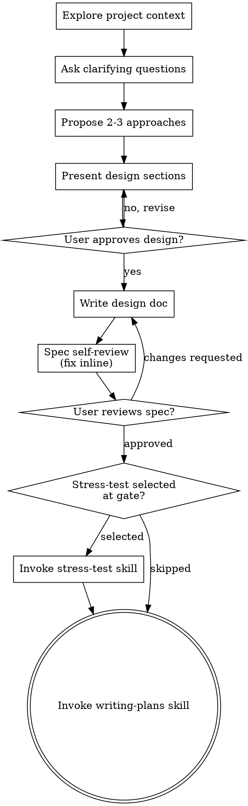

# Brainstorming Ideas Into Designs

Help turn ideas into fully formed designs and specs through natural collaborative dialogue.

Start by understanding the current project context, then ask questions one at a time to refine the idea. Once you understand what you're building, present the design and get user approval.

<HARD-GATE>
Do NOT invoke any implementation skill, write any code, scaffold any project, or take any implementation action until you have presented a design and the user has approved it. This applies to EVERY project regardless of perceived simplicity.
</HARD-GATE>

**Production-Grade Doctrine** applies with full force here — trade-offs are *first chosen* in brainstorming: you MUST NOT simplify a design by quietly cutting a required behavior; surface every material trade-off and let the user decide. Never weaken, bypass, or remove a security control — a security regression is never acceptable.

## Anti-Pattern: "This Is Too Simple To Need A Design"

Every project goes through this process. A todo list, a single-function utility, a config change — all of them. "Simple" projects are where unexamined assumptions cause the most wasted work. The design can be short (a few sentences for truly simple projects), but you MUST present it and get approval.

## Checklist

You MUST create the session bead + step children atomically via `bd create --graph` (one JSON: session node `-t task` titled "Brainstorming: <topic>", each checklist step a `-t chore` child node with `parent_key` pointing to the session; `--dry-run` first), then complete them in order. Fall back to sequential `bd create "Brainstorming: <topic>" -t task` + `bd create "Step N: <title>" -t chore --parent <session-bead-id>` only if `--graph` is unavailable:

The session bead always stays permanent (it's the audit trail). Graph JSON nodes do not accept an `ephemeral` field (verified: `bd create --graph ... --dry-run` silently drops unknown node fields with a warning), so step children created via `--graph` are permanent chores. If the operator prefers hidden ceremony beads for the step children instead, create them individually: `bd create "Step N: <title>" -t chore --parent <session-bead-id> --ephemeral` — trade-off: `--graph` is one call and permanent; individual creation is N calls and ephemeral. Ephemeral beads are hidden from `bd ready`/`bd list`/`bd count` by default and do not self-clean — sweep them eventually with `bd purge`.

1. **Explore project context** — check files, docs, recent commits
2. **Offer the visual companion just-in-time** — NOT upfront. The first time a question would genuinely be clearer shown than described, offer it then (its own message); on approval its browser tab opens for you. If no visual question ever arises, never offer it. See the Visual Companion section below.
3. **Ask clarifying questions** — one at a time, understand purpose/constraints/success criteria
4. **Propose 2-3 approaches** — with trade-offs and your recommendation
5. **Present design** — in sections scaled to their complexity, get user approval after each section
6. **Write design doc** — save to `.internal/specs/YYYY-MM-DD-<topic>-design.md` and commit
7. **Spec self-review** — quick inline check for placeholders, contradictions, ambiguity, scope (see below)
8. **User reviews written spec** — ask user to review the spec file before proceeding
9. **Spec-review gate offers stress-test** — the spec-review gate (step 8) includes an "Approved + stress-test" option, offered every time; if selected, invoke `stress-test` before writing-plans
10. **Transition to implementation** — invoke writing-plans skill to create implementation plan

## Process Flow



**The terminal state is writing-plans.** The only other skill brainstorming may invoke is **stress-test** (optional, between spec approval and writing-plans). Do NOT invoke frontend-design, mcp-builder, or any other implementation skill.

## The Process

**Understanding the idea:**

- Check out the current project state first (files, docs, recent commits)
- Before asking detailed questions, assess scope: if the request describes multiple independent subsystems (e.g., "build a platform with chat, file storage, billing, and analytics"), flag this immediately. Don't spend questions refining details of a project that needs to be decomposed first.
- If the project is too large for a single spec, help the user decompose into sub-projects: what are the independent pieces, how do they relate, what order should they be built? Then brainstorm the first sub-project through the normal design flow. Each sub-project gets its own spec → plan → implementation cycle.
- For appropriately-scoped projects, ask questions one at a time to refine the idea
- Prefer multiple choice questions when possible — **use your structured question tool** for these (structured options are faster to answer than reading text and typing a response). Open-ended questions that don't have clear discrete options can remain as text.
- Only one question per message - if a topic needs more exploration, break it into multiple questions
- Focus on understanding: purpose, constraints, success criteria

**Exploring approaches:**

- Propose 2-3 different approaches with trade-offs
- **Use your structured question tool** to present the approaches as structured options. Put your recommended option first with "(Recommended)" in the label. Use the `description` field for trade-offs and reasoning. This is more efficient than text blocks that require the user to read and type a response.
- If approaches need detailed explanation beyond what fits in option descriptions, present the analysis as text first, THEN follow up with a structured question for the actual selection

**Presenting the design:**

- Once you believe you understand what you're building, present the design
- Scale each section to its complexity: a few sentences if straightforward, up to 200-300 words if nuanced
- After presenting each section, **use your structured question tool** to check approval (content below; shape shown in Claude Code schema — adapt to your tool):
  ```json
  {
    "questions": [{
      "question": "Does the <section-name> section look right?",
      "header": "Design",
      "options": [
        {"label": "Looks good", "description": "Approve this section and move to the next one"},
        {"label": "Needs changes", "description": "I have feedback or revisions for this section"}
      ],
      "multiSelect": false
    }]
  }
  ```
- Cover: architecture, components, data flow, error handling, security, testing
- Be ready to go back and clarify if something doesn't make sense

**Design for isolation and clarity:**

- Break the system into smaller units that each have one clear purpose, communicate through well-defined interfaces, and can be understood and tested independently
- For each unit, you should be able to answer: what does it do, how do you use it, and what does it depend on?
- Can someone understand what a unit does without reading its internals? Can you change the internals without breaking consumers? If not, the boundaries need work.
- Smaller, well-bounded units are also easier for you to work with - you reason better about code you can hold in context at once, and your edits are more reliable when files are focused. When a file grows large, that's often a signal that it's doing too much.

**Working in existing codebases:**

- Explore the current structure before proposing changes. Follow existing patterns.
- Where existing code has problems that affect the work (e.g., a file that's grown too large, unclear boundaries, tangled responsibilities), include targeted improvements as part of the design - the way a good developer improves code they're working in.
- Don't propose unrelated refactoring. Stay focused on what serves the current goal.

## After the Design

**Documentation:**

- Write the validated design (spec) to `.internal/specs/YYYY-MM-DD-<topic>-design.md`
  - (User preferences for spec location override this default)
- Commit the design document to git

> When filing a bead for discovered/follow-up work, stamp it per **Agent-Filed Bead Discipline** (`verification-before-completion`).

After the work is settled, present the Capture gate (you MUST present it; the user picks Skip if nothing is worth keeping):

```json
{
  "questions": [{
    "question": "This produced something worth preserving — what should I capture?",
    "header": "Capture",
    "options": [
      {"label": "ADR + memory", "description": "Record an ADR for the decision AND a durable bd-remember memory"},
      {"label": "ADR only", "description": "Record an ADR for the architecturally-significant decision"},
      {"label": "Memory only", "description": "Capture a durable lesson/insight via bd remember"},
      {"label": "Skip", "description": "Nothing here is durable enough to preserve"}
    ],
    "multiSelect": false
  }]
}
```

Route: **ADR / ADR+memory** → write the ADR per the 3-mark gate (`decisions/ADR-NNNN-<kebab>.md`, sections Context/Decision/Rationale/Consequences, update `decisions/INDEX.md`). **Memory / ADR+memory** → `bd remember "<kind>: <durable, evidence-backed insight>"`. **Skip** → nothing.

**Spec Self-Review:**
After writing the spec document, look at it with fresh eyes:

1. **Placeholder scan:** Any "TBD", "TODO", incomplete sections, or vague requirements? Fix them.
2. **Internal consistency:** Do any sections contradict each other? Does the architecture match the feature descriptions?
3. **Scope check:** Is this focused enough for a single implementation plan, or does it need decomposition?
4. **Ambiguity check:** Could any requirement be interpreted two different ways? If so, pick one and make it explicit.

Fix any issues inline. No need to re-review — just fix and move on.

**User Review Gate:**
After the spec review loop passes, **open the spec file in the user's editor** so they can review it, then gate progression with your structured question tool (content below; shape shown in Claude Code schema — adapt to your tool):

**User's preferred editor:** !`echo ${VISUAL:-${EDITOR:-not-configured}}`

**⚠️ Run the open command as a standalone Bash call** — never chain it after `bd` commands in the same invocation (e.g., `bd close <id> && open file.md`). The combination hangs.

```bash
# Open in user's preferred editor, with platform fallbacks
if [ -n "$VISUAL" ]; then
  "$VISUAL" "<spec-file-path>"
elif [ -n "$EDITOR" ]; then
  "$EDITOR" "<spec-file-path>"
elif command -v open >/dev/null 2>&1; then
  open "<spec-file-path>"
else
  xdg-open "<spec-file-path>" 2>/dev/null
fi
# If none available: just report the path
```

Then immediately ask via your structured question tool (content below; shape shown in Claude Code schema — adapt to your tool):

<!-- Canonical 3-option stress-test gate — keep identical to writing-plans/SKILL.md -->

```json
{
  "questions": [{
    "question": "Spec opened in your editor at `<path>`. Review it and let me know how to proceed.",
    "header": "Spec review",
    "options": [
      {"label": "Approved + stress-test (Recommended)", "description": "Spec looks good — run an adversarial stress-test before writing the plan"},
      {"label": "Approved", "description": "Spec looks good — skip stress-test and proceed to writing the implementation plan"},
      {"label": "Needs changes", "description": "I want to revise the spec before proceeding"}
    ],
    "multiSelect": false
  }]
}
```

Route on the answer:
- **Approved + stress-test** → invoke the `stress-test` skill with the spec path (`.internal/specs/YYYY-MM-DD-<topic>-design.md`) as the Mode-A artifact; when it completes, invoke `writing-plans`.
- **Approved** → invoke `writing-plans` directly.
- **Needs changes** → make the requested changes and re-run the spec review loop. Only proceed once approved.

**Implementation:**

- The stress-test offer now lives in the spec-review gate above (the "Approved + stress-test" option) — there is no separate stress-test prompt.
- Invoke the writing-plans skill to create a detailed implementation plan (after stress-test, if selected).
- Do NOT invoke any other skill besides stress-test (offered at the gate) and writing-plans.
- Pass the brainstorming bead context forward: the epic bead created during plan execution should reference the brainstorming session bead via `bd dep add <epic-id> <brainstorming-bead-id> --type discovered-from`

## Key Principles

- **One question at a time** - Don't overwhelm with multiple questions
- **Multiple choice preferred** - Easier to answer than open-ended when possible
- **YAGNI ruthlessly** - Remove unnecessary *speculative* features from all designs (never drop a required behavior, edge case, or security control — that is descoping, not YAGNI)
- **Explore alternatives** - Always propose 2-3 approaches before settling
- **Incremental validation** - Present design, get approval before moving on
- **Be flexible** - Go back and clarify when something doesn't make sense

## Visual Companion

A browser-based companion for showing mockups, diagrams, and visual options during brainstorming. Available as a tool — not a mode. Accepting the companion means it's available for questions that benefit from visual treatment; it does NOT mean every question goes through the browser.

**Offering the companion (just-in-time):** Do NOT offer it upfront. Wait until a question would genuinely be clearer shown than told — a real mockup / layout / diagram question, not merely a UI *topic*. The first time that happens, offer it then for consent using your structured question tool. **This offer MUST be its own message.** Do not combine it with clarifying questions, context summaries, or any other content. If they decline, continue text-only and don't offer again unless they raise it.

```json
{
  "questions": [{
    "question": "This next part might be easier to show than describe. I can put together mockups, diagrams, and comparisons in a web browser as we go. This feature is still new and can be token-intensive. Want me to? (Requires opening a local URL)",
    "header": "Visual",
    "options": [
      {"label": "Yes, use visuals", "description": "Open a browser companion for mockups and diagrams during brainstorming"},
      {"label": "No, text only", "description": "Continue with text-based brainstorming in the terminal"}
    ],
    "multiSelect": false
  }]
}
```

Wait for the user's response before continuing. If they decline, proceed with text-only brainstorming.

**Per-question decision:** Even after the user accepts, decide FOR EACH QUESTION whether to use the browser or the terminal. The test: **would the user understand this better by seeing it than reading it?**

- **Use the browser** for content that IS visual — mockups, wireframes, layout comparisons, architecture diagrams, side-by-side visual designs
- **Use the terminal** for content that is text — requirements questions, conceptual choices, tradeoff lists, A/B/C/D text options, scope decisions

A question about a UI topic is not automatically a visual question. "What does personality mean in this context?" is a conceptual question — use the terminal. "Which wizard layout works better?" is a visual question — use the browser.

If they agree to the companion, read the detailed guide before proceeding:
`skills/brainstorming/visual-companion.md`

## Integration

**Invokes:**
- **stress-test** *(optional)* — offered at the spec-review gate every time (the "Approved + stress-test" option), before writing-plans.
- **writing-plans** — terminal state. The only implementation skill brainstorming invokes.
