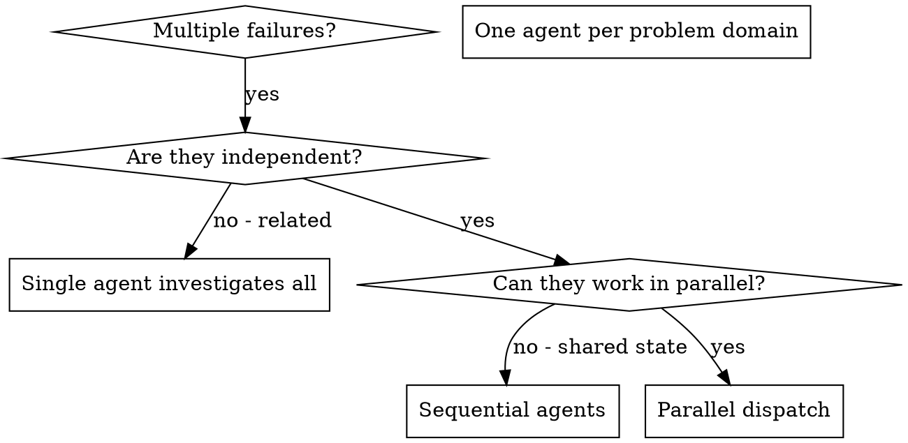

# Dispatching Parallel Agents

## Overview

You delegate tasks to specialized agents with isolated context. By precisely crafting their instructions and context, you ensure they stay focused and succeed at their task. They should never inherit your session's context or history — you construct exactly what they need. This also preserves your own context for coordination work.

When you have multiple independent tasks — whether bug investigations, plan tasks, or subsystem changes — executing them sequentially wastes time. Each task is independent and can happen in parallel, provided each agent gets its own isolated workspace.

**Core principle:** Dispatch one agent per independent problem domain. Let them work concurrently.

## When to Use



**Use when:**
- 3+ test files failing with different root causes
- Multiple subsystems broken independently
- Each problem can be understood without context from others
- No shared state between investigations
- 2+ independent plan tasks with no dependency edges between them
- Multiple independent subsystem changes (different files, different concerns)

**Don't use when:**
- Failures are related (fix one might fix others)
- Need to understand full system state
- Agents would interfere with each other

## The Pattern

### 1. Identify Independent Domains

Group failures by what's broken:
- File A tests: Tool approval flow
- File B tests: Batch completion behavior
- File C tests: Abort functionality

Each domain is independent - fixing tool approval doesn't affect abort tests.

### Before you fan out (orchestrator-only)

Worktrees isolate *files*, not *assumptions* — parallel agents on different files can still diverge on an un-prescribed shared decision (MAST FC2). Before dispatching:

1. **Front-load shared decisions** — list every decision ≥2 agents depend on (schemas, naming, interfaces, conventions); decide each once and write it verbatim into *every* agent prompt.
2. **Share full context, not summaries** — give each agent the relevant traces/facts, not a lossy digest.

This is orchestrator discipline applied before dispatch; do not ask subagents to coordinate with each other.

### 2. Create Focused Agent Tasks

Each agent gets:
- **Specific scope:** One test file or subsystem
- **Clear goal:** Make these tests pass
- **Constraints:** Don't change other code
- **Expected output:** Summary of what you found and fixed

### 3. Dispatch in Parallel

```typescript
// In Claude Code / AI environment
Task("Fix agent-tool-abort.test.ts failures")
Task("Fix batch-completion-behavior.test.ts failures")
Task("Fix tool-approval-race-conditions.test.ts failures")
// All three run concurrently
```

### 4. Review and Integrate

When agents return:
- Read each summary
- Verify fixes don't conflict
- Run full test suite
- Integrate all changes

## Agent Prompt Structure

Good agent prompts are:
1. **Focused** - One clear problem domain
2. **Self-contained** - All context needed to understand the problem
3. **Specific about output** - What should the agent return?

```markdown
Fix the 3 failing tests in src/agents/agent-tool-abort.test.ts:

1. "should abort tool with partial output capture" - expects 'interrupted at' in message
2. "should handle mixed completed and aborted tools" - fast tool aborted instead of completed
3. "should properly track pendingToolCount" - expects 3 results but gets 0

These are timing/race condition issues. Your task:

1. Read the test file and understand what each test verifies
2. Identify root cause - timing issues or actual bugs?
3. Fix by:
   - Replacing arbitrary timeouts with event-based waiting
   - Fixing bugs in abort implementation if found
   - Adjusting test expectations if testing changed behavior

Do NOT just increase timeouts - find the real issue.

Return: Summary of what you found and what you fixed.
```

## Common Mistakes

**❌ Too broad:** "Fix all the tests" - agent gets lost
**✅ Specific:** "Fix agent-tool-abort.test.ts" - focused scope

**❌ No context:** "Fix the race condition" - agent doesn't know where
**✅ Context:** Paste the error messages and test names

**❌ No constraints:** Agent might refactor everything
**✅ Constraints:** "Do NOT change production code" or "Fix tests only"

**❌ Vague output:** "Fix it" - you don't know what changed
**✅ Specific:** "Return summary of root cause and changes"

## When NOT to Use

**Related failures:** Fixing one might fix others - investigate together first
**Need full context:** Understanding requires seeing entire system
**Exploratory debugging:** You don't know what's broken yet
**Shared state:** Agents would interfere (editing same files, using same resources)
**Single task:** Only one task remaining — no parallelism benefit
**Same files:** Tasks that modify the same files — merge conflicts likely even with worktree isolation

## Integration

**Invoked by:**
- **subagent-driven-development** — parallel batch mode dispatches independent plan tasks concurrently, each in its own worktree. Uses this skill's dispatch pattern. See SDD Integration below.
- **getting-up-to-speed** — heavy path (500+ tracked files) dispatches @researcher + @explore in parallel via this pattern.

**Invokes:** None — this is a dispatch pattern skill, not a pipeline skill.

## SDD Integration

Subagent-Driven Development uses this skill's **pattern** — not the skill itself — when executing plans with independent tasks.

**How SDD uses the pattern:**

1. SDD detects independent task batches via `bd ready --parent <epic-id>` (tasks with no unresolved dependencies)
2. Orchestrator creates one `bd worktree` per task — subagent receives path, never creates worktrees itself
3. Dispatches all implementer subagents in one message via multiple `Agent` tool calls (max 5 per batch)
4. SDD handles merge-back into the epic worktree after review

**Key difference from standalone use:** In SDD, the orchestrator manages the full lifecycle (worktree creation → dispatch → review → merge → cleanup). This skill describes the dispatch pattern; SDD adds the orchestration layer.

**Example — plan task execution with per-task worktrees:**

```
Orchestrator identifies 3 unblocked tasks (no deps between them):
  Task A: Add validation to user input (touches src/validation.py)
  Task B: Add logging middleware (touches src/middleware.py)
  Task C: Update API docs (touches docs/api.md)

Orchestrator creates per-task worktrees:
  bd worktree create task-a --branch feature/epic/task-a
  bd worktree create task-b --branch feature/epic/task-b
  bd worktree create task-c --branch feature/epic/task-c

Dispatches 3 subagents in parallel (one Agent call each, same message):
  Agent 1 → "Work from: .worktrees/task-a" → implements validation
  Agent 2 → "Work from: .worktrees/task-b" → implements middleware
  Agent 3 → "Work from: .worktrees/task-c" → updates docs

After all 3 pass review:
  git merge feature/epic/task-a (in epic worktree)
  git merge feature/epic/task-b
  git merge feature/epic/task-c
  bd worktree remove task-a task-b task-c
  Run full test suite → integration check
```

> **Concurrent orchestrators (optional — `bd merge-slot`):** The merges above are run by a single orchestrator, one at a time, so there is no merge race in the normal flow. If two or more orchestrators or sessions ever run this pattern concurrently against the same repo, serialize their merges with the beads v1.0.5 merge slot: `bd merge-slot create` once, then `bd merge-slot acquire` before each `git merge` and `bd merge-slot release` after — so only one orchestrator resolves conflicts at a time.

## Real Example from Session

**Scenario:** 6 test failures across 3 files after major refactoring

**Failures:**
- agent-tool-abort.test.ts: 3 failures (timing issues)
- batch-completion-behavior.test.ts: 2 failures (tools not executing)
- tool-approval-race-conditions.test.ts: 1 failure (execution count = 0)

**Decision:** Independent domains - abort logic separate from batch completion separate from race conditions

**Dispatch:**
```
Agent 1 → Fix agent-tool-abort.test.ts
Agent 2 → Fix batch-completion-behavior.test.ts
Agent 3 → Fix tool-approval-race-conditions.test.ts
```

**Results:**
- Agent 1: Replaced timeouts with event-based waiting
- Agent 2: Fixed event structure bug (threadId in wrong place)
- Agent 3: Added wait for async tool execution to complete

**Integration:** All fixes independent, no conflicts, full suite green

**Time saved:** 3 problems solved in parallel vs sequentially

## Key Benefits

1. **Parallelization** - Multiple investigations happen simultaneously
2. **Focus** - Each agent has narrow scope, less context to track
3. **Independence** - Agents don't interfere with each other
4. **Speed** - 3 problems solved in time of 1

## Verification

After agents return:
1. **Review each summary** - Understand what changed
2. **Check for conflicts** - Did agents edit same code?
3. **Run full suite** - Verify all fixes work together
4. **Spot check** - Agents can make systematic errors
5. **No weakening to "pass"** - An agent may not satisfy its narrow goal by weakening tests, dropping a requirement, or regressing security — verify this on integration (Production-Grade Doctrine)

**Capture what you learned.** At close, record every durable, evidence-backed insight from this work — anything still true next month, tied to a file, test, or command. Don't skip because it feels minor: if it would save a future session time or stop a repeated mistake, record it. Never record guesses, one-offs, or secrets (tokens, keys, PII — every memory is injected into all future sessions). Update an existing memory in place (`bd remember --key <key>`) rather than adding a near-duplicate.

```bash
bd remember "<kind>: <durable, evidence-backed insight>"   # kind: lesson / pattern / design / root-cause / research
```

## Real-World Impact

From debugging session (2025-10-03):
- 6 failures across 3 files
- 3 agents dispatched in parallel
- All investigations completed concurrently
- All fixes integrated successfully
- Zero conflicts between agent changes
