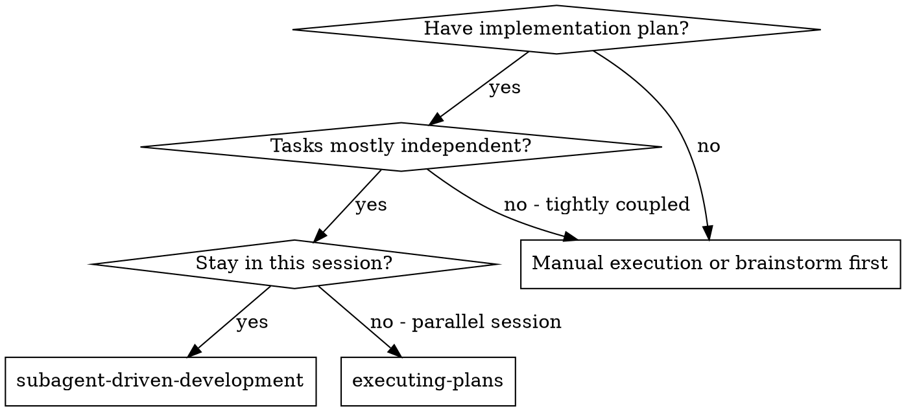
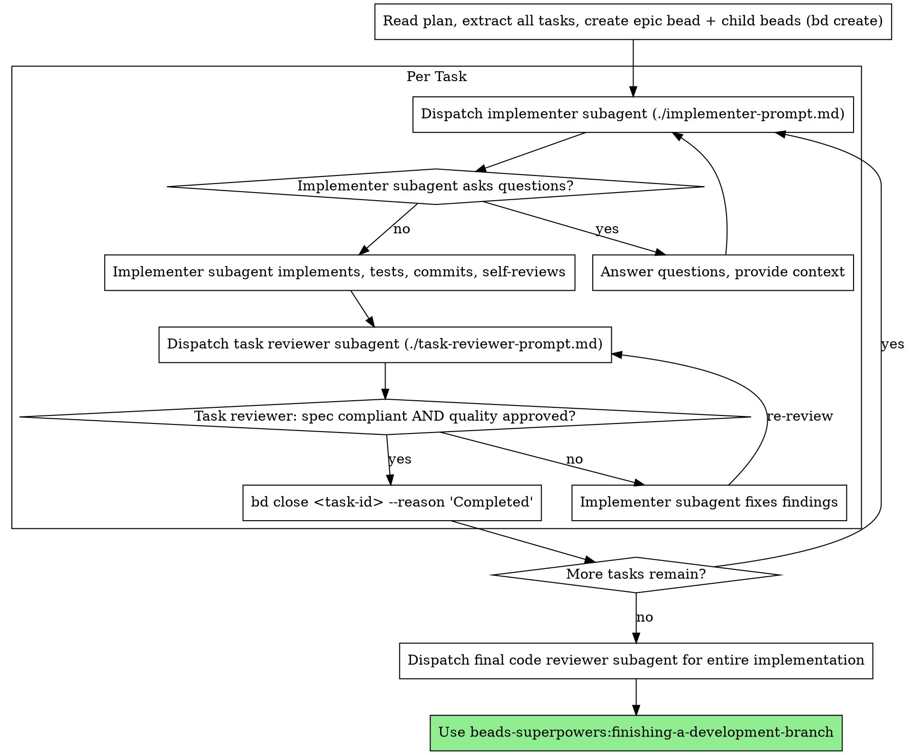
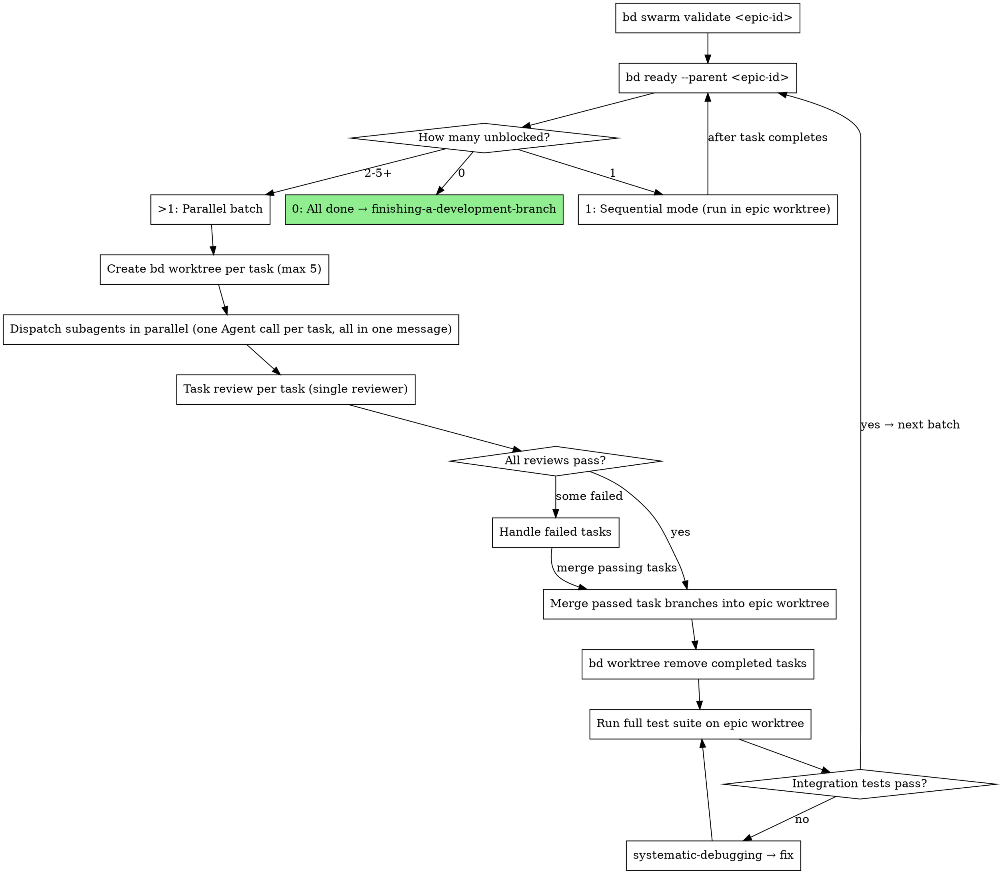

# Subagent-Driven Development

Execute plan by dispatching fresh subagent per task, with a single read-only task review after each — one reviewer returns a spec-compliance verdict and a code-quality verdict in one pass.

**Why subagents:** You delegate tasks to specialized agents with isolated context. By precisely crafting their instructions and context, you ensure they stay focused and succeed at their task. They should never inherit your session's context or history — you construct exactly what they need. This also preserves your own context for coordination work.

**Core principle:** Fresh subagent per task + a single read-only task review (spec + quality verdicts in one pass) = high quality, fast iteration

**Continuous execution:** Do not pause to check in with your human partner between tasks. Execute all tasks from the plan without stopping. The only reasons to stop are: BLOCKED status you cannot resolve, ambiguity that genuinely prevents progress, or all tasks complete. "Should I continue?" prompts and progress summaries waste their time — they asked you to execute the plan, so execute it.

## When to Use



**vs. Executing Plans (parallel session):**
- Same session (no context switch)
- Fresh subagent per task (no context pollution)
- One task review after each task: spec-compliance and code-quality verdicts in a single read-only pass
- Faster iteration (no human-in-loop between tasks)

## Pre-Flight Plan Review

Before dispatching Task 1, scan the plan once for conflicts:

- tasks that contradict each other or the plan's Global Constraints
- anything the plan explicitly mandates that the review rubric treats as a defect (a test that asserts nothing, verbatim duplication of a logic block)

Present everything you find to your human partner as **one batched structured question** — each finding beside the plan text that mandates it, asking which governs — before execution begins, not one interrupt per discovery mid-plan. If the scan is clean, proceed without comment. The review loop remains the net for conflicts that only emerge from implementation.

## The Process (Sequential Mode)

> This section describes **sequential execution** — one task at a time in a shared epic worktree. This is the default when tasks have dependencies or only one task is unblocked. For parallel execution of independent tasks, see **Parallel Batch Mode** below.



**Checking for remaining tasks:** Use `bd ready --parent <epic-id>` to see remaining unblocked child tasks. Use `bd epic status <epic-id>` for a summary view of completion percentage. When `bd ready` returns no results for the epic, all tasks are complete.

> **bd frugality: bounded output, one round trip.** Cap reads: `bd ready -n 10`,
> `bd show --short <id>` to skim (full `bd show` only when the body is needed),
> `bd memories <keyword>` (NEVER bare `bd memories` — it dumps the whole store).
> Batch writes: several creates/updates/closes = one `bd batch` or `bd create --graph`
> call, not a loop. Filter big outputs before they hit context
> (`... | grep -E "PATTERN" | head -20`). Keep write confirmations — they are evidence.
> **`--claim` boundary:** `bd ready --claim` ONLY in autonomous take-next-task flows
> (this skill's batch/wave dispatch). FORBIDDEN wherever the user picks the work —
> orientation, brainstorming, session close. Efficiency never erodes a consent gate.

## Parallel Batch Mode

When `bd ready --parent <epic-id>` returns multiple unblocked tasks, those tasks have no dependencies between them and can execute in parallel — each in its own isolated `bd worktree`.

**Core principle:** One `bd worktree` per task + parallel dispatch = safe concurrency with per-task rollback.

**Parallel cap:** Maximum 5 subagents per batch. If more tasks are unblocked, split into batches of 5.

### Before you fan out (orchestrator-only)

Worktrees isolate *files*, not *assumptions* — parallel agents on different files can still diverge on an un-prescribed shared decision (MAST FC2). Before dispatching:

1. **Front-load shared decisions** — list every decision ≥2 agents depend on (schemas, naming, interfaces, conventions); decide each once and write it verbatim into *every* agent prompt.
2. **Share full context, not summaries** — give each agent the relevant traces/facts, not a lossy digest.

This is orchestrator discipline applied before dispatch; do not ask subagents to coordinate with each other.

### Batch Execution Flow



### Parallel Batch Walkthrough

```
1. Orchestrator creates epic worktree (once, at the start):
     bd worktree create <epic-name>

2. Analyze the work graph before dispatching:
     bd swarm validate <epic-id>
     → Shows wave structure (which tasks can run concurrently vs sequentially),
       max parallelism, estimated worker-sessions, and dependency warnings.
     Use this to plan batch sizes and catch missing dependencies before
     wasting subagent runs on tasks that will block.

3. Get unblocked tasks:
     bd ready --parent <epic-id>
     → Returns N tasks with no unresolved dependencies

4. If N > 1 (parallel batch, cap at 5 per batch):
   For each task in the batch:
     bd worktree create <task-name> --branch feature/<epic>/<task>

5. Dispatch all subagents in parallel:
   Read ./implementer-prompt.md, then one Agent tool call per task, ALL in the same message:
     Agent({
       description: "Implement Task N: <name>",
       prompt: "<implementer-prompt content with 'Work from: <task-worktree-path>'>",
       subagent_type: "general-purpose"
     })

6. Task review per task (can also run in parallel):
   Dispatch the single task reviewer (./task-reviewer-prompt.md) with the task
   brief, the implementer's report file, and the review-package diff. It returns
   a spec-compliance verdict (✅/❌/⚠️) and a code-quality verdict in one pass.

7. For each task that passes review:
     cd <epic-worktree-path>
     git merge feature/<epic>/<task>
     bd worktree remove <task-name>
     bd close <task-id> --reason "Completed: reviews passed"

8. Run full test suite on epic worktree (integration check):
   If fail → invoke systematic-debugging → fix before next batch

9. Re-run bd ready --parent <epic-id>
   Repeat from step 3 until no tasks remain

9. If N == 1 at any point:
   Sequential mode — run in epic worktree directly, no per-task worktree needed
```

> **Tip:** Use `bd -C .worktrees/<task> ready` to check task status across worktrees without changing directory.

> **Concurrent orchestrators (optional — `bd merge-slot`):** Step 7's merges run through a single orchestrator, one at a time, so the normal flow has no merge race and needs no coordination. The exception is when **two or more orchestrators or sessions** run SDD concurrently against the same repo (overlapping epics) — their merges into the shared base could collide. For that case only, serialize merges with the beads v1.0.5 merge slot: `bd merge-slot create` once for the repo, then wrap each task merge as `bd merge-slot acquire` → `git merge feature/<epic>/<task>` → `bd merge-slot release`, so only one orchestrator resolves conflicts at a time. Pairs with the `bd swarm validate` pre-step above.

### Failed Task Handling

When a parallel task fails review:

1. **Do not merge** its task branch into the epic branch.
2. **Option A — Re-dispatch:** Keep the task worktree. Re-dispatch a fix subagent with reviewer feedback. Re-review after fix.
3. **Option B — Discard:** `bd worktree remove <task-name>` discards the branch. Task bead stays open and will appear in the next `bd ready --parent` batch.
4. Other parallel tasks that passed review are still merged independently — one failure does not block the batch.

### Mode Selection

```
tasks = bd ready --parent <epic-id>

if len(tasks) == 0:
    All done → invoke finishing-a-development-branch
elif len(tasks) == 1:
    Sequential mode (run in epic worktree, existing behavior)
elif len(tasks) <= 5:
    Parallel batch (one bd worktree per task)
else:
    Take first 5 → parallel batch, remaining wait for next iteration
```

Mode selection is automatic. The orchestrator checks after every batch or sequential task completes.

## Model Selection

Use the least powerful model that can handle each role to conserve cost and increase speed.

**Always specify the model explicitly when dispatching a subagent.** An omitted model inherits your session's model — often the most expensive — which silently defeats this section. For review tasks, scale the model to the diff's size, complexity, and risk: a small mechanical diff does not need the most capable model; a subtle concurrency change does.

**Mechanical implementation tasks** (isolated functions, clear specs, 1-2 files): use a fast, cheap model. Most implementation tasks are mechanical when the plan is well-specified.

**Integration and judgment tasks** (multi-file coordination, pattern matching, debugging): use a standard model.

**Architecture, design, and review tasks**: use the most capable available model.

**Task complexity signals:**
- Touches 1-2 files with a complete spec → cheap model
- Touches multiple files with integration concerns → standard model
- Requires design judgment or broad codebase understanding → most capable model

## Handling Implementer Status

Implementer subagents report one of four statuses. Handle each appropriately:

**DONE:** Proceed to spec compliance review.

**DONE_WITH_CONCERNS:** The implementer completed the work but flagged doubts. Read the concerns before proceeding. If the concerns are about correctness or scope, address them before review. If they're observations (e.g., "this file is getting large"), note them and proceed to review.

**NEEDS_CONTEXT:** The implementer needs information that wasn't provided. Provide the missing context and re-dispatch.

**BLOCKED:** The implementer cannot complete the task. Assess the blocker:
1. If it's a context problem, provide more context and re-dispatch with the same model
2. If the task requires more reasoning, re-dispatch with a more capable model
3. If the task is too large, break it into smaller pieces
4. If the plan itself is wrong, escalate to the human

> **Blocker-bead stamp:** `bd create "[spec] <title>" -t task --parent <epic-id> --notes "Severity:/Confidence:/Evidence:"` — see `verification-before-completion` → Agent-Filed Bead Discipline.

**Never** ignore an escalation or force the same model to retry without changes. If the implementer said it's stuck, something needs to change.

**Capture what you learned.** At close, record every durable, evidence-backed insight from this work — anything still true next month, tied to a file, test, or command. Don't skip because it feels minor: if it would save a future session time or stop a repeated mistake, record it. Never record guesses, one-offs, or secrets (tokens, keys, PII — every memory is injected into all future sessions). Update an existing memory in place (`bd remember --key <key>`) rather than adding a near-duplicate.

```bash
bd remember "<kind>: <durable, evidence-backed insight>"   # kind: lesson / pattern / design / root-cause / research
```

## Handling Reviewer ⚠️ Items

The task reviewer returns a Spec Compliance verdict of ✅, ❌, or ⚠️. A ⚠️ "cannot verify from diff" item does **not** block the task on its own — but you (the controller) must resolve it, because it usually needs cross-task context the reviewer lacks. Check the named requirement against the broader implementation. If the ⚠️ turns out to be a real gap, treat it as a failed spec review and re-dispatch the implementer to close it; if it's actually satisfied elsewhere, record that and proceed.

## File Handoffs

Hand task text and review diffs to subagents as **files**, not pasted context — this keeps large text out of your own context and gives subagents a single thing to read.

- Before dispatching an implementer, run `scripts/task-brief <plan-file> <N>` → writes `.internal/sdd/task-<N>-brief.md`. Pass that path to the implementer as "read this first — it is your requirements."
- The implementer writes its full report to `.internal/sdd/task-<N>-report.md` (you name the path in the dispatch via `[REPORT_FILE]`); the reviewer reads it as a file.
- Before dispatching the reviewer, run `scripts/review-package <BASE> <HEAD>` → writes `.internal/sdd/review-<base7>..<head7>.diff` (commit log + file stat + unified diff). Pass that path to the reviewer. `BASE` is the commit recorded before the implementer ran — never `HEAD~1`.
- The reviewer is **read-only**: it must not mutate the working tree, the index, HEAD, or branch state.
- `.internal/sdd/` is resolved **per working tree** (`scripts/sdd-workspace`). In Parallel Batch Mode each `bd worktree` therefore gets its own isolated directory — concurrent tasks never collide on brief/report/diff filenames.

## Prompt Templates

Dispatch via the `Agent` tool:

1. `Read` the prompt template file
2. Use its content as the `prompt` parameter
3. Use `subagent_type: "general-purpose"` (do NOT use `"implementer"` — that is Claude Code's built-in implementer agent with its own system prompt, which overrides the prompt template)

- `./implementer-prompt.md` - Dispatch implementer subagent
- `./task-reviewer-prompt.md` - Dispatch the single task reviewer subagent (returns spec-compliance + code-quality verdicts in one read-only pass)

## Example Workflow

```
You: I'm using Subagent-Driven Development to execute this plan.

[Read plan file once: .internal/plans/feature-plan.md]
[Extract all 5 tasks with full text and context]
[Create epic + tasks + deps atomically via bd create --graph:]
[  Build plan.json: {nodes:[{key,title,type,priority,parent_key,description}],]
[                   edges:[{from_key:<dependent>,to_key:<dependency>,type:"blocks"}]}]
[  Each description embeds the bd lint-required section: epic -> "## Success Criteria",]
[  task -> "## Acceptance Criteria" (copied from the plan; no separate graph field exists)]
[  bd create --graph plan.json --dry-run   <- dry-run first]
[  bd create --graph plan.json]
[  Fallback: sequential bd create loop + bd dep add if --graph unavailable]
[  Tip: wire multiple deps atomically to avoid orphaned deps if one fails:]
[  printf 'dep add <task-3-id> <task-1-id>\ndep add <task-3-id> <task-2-id>\n' | bd batch]

Task 1: Hook installation script

[Get Task 1 text and context (already extracted)]
[Dispatch implementation subagent with full task text + context]

Implementer: "Before I begin - should the hook be installed at user or system level?"

You: "User level (~/.config/superpowers/hooks/)"

Implementer: "Got it. Implementing now..."
[Later] Implementer:
  - Implemented install-hook command
  - Added tests, 5/5 passing
  - Self-review: Found I missed --force flag, added it
  - Committed

[Generate review package: scripts/review-package BASE HEAD]
[Dispatch single task reviewer with the brief, report file, and diff]
Task reviewer:
  Spec Compliance: ✅ Spec compliant - all requirements met, nothing extra
  Strengths: Good test coverage, clean
  Issues: None
  Task quality: Approved

[bd close <task-1-id> --reason "Completed: review clean, commits a1b2c3d..e4f5a6b"]

Task 2: Recovery modes

[Get Task 2 text and context (already extracted)]
[Dispatch implementation subagent with full task text + context]

Implementer: [No questions, proceeds]
Implementer:
  - Added verify/repair modes
  - 8/8 tests passing
  - Self-review: All good
  - Committed

[Generate review package + dispatch single task reviewer]
Task reviewer:
  Spec Compliance: ❌ Issues:
    - Missing: Progress reporting (spec says "report every 100 items")
    - Extra: Added --json flag (not requested)
  Issues (Important): Magic number (100)
  Task quality: Needs fixes

[Implementer fixes all findings in one pass]
Implementer: Removed --json flag, added progress reporting, extracted PROGRESS_INTERVAL constant

[Re-generate review package + re-dispatch task reviewer]
Task reviewer:
  Spec Compliance: ✅ Spec compliant now
  Task quality: Approved

[bd close <task-2-id> --reason "Completed: review clean, commits e4f5a6b..c7d8e9f"]

...

[After all tasks]
[Dispatch final code-reviewer]
Final reviewer: All requirements met, ready to merge

Done!
```

## Durable Progress

Conversation memory does not survive compaction, and a controller that loses its place can re-dispatch completed tasks. **Beads is your durable ledger** — it survives compaction and is reloaded by `bd prime`. After any interruption, run `bd ready --parent <epic-id>`: tasks still open are the remaining work; closed task beads are done — do not re-dispatch them. Record each task's commit range in its close reason so `git log` recovery works without a separate file, e.g. `bd close <task-id> --reason "Completed: commits <base7>..<head7>, review clean"`. Do **not** keep a separate markdown progress ledger — the beads DB is the single source of truth.

## Advantages

**vs. Manual execution:**
- Subagents follow TDD naturally
- Fresh context per task (no confusion)
- Parallel-safe (subagents don't interfere)
- Subagent can ask questions (before AND during work)

**vs. Executing Plans:**
- Same session (no handoff)
- Continuous progress (no waiting)
- Review checkpoints automatic

**Efficiency gains:**
- Task brief and review diffs handed as files (see File Handoffs) — large text stays out of the controller's context
- Controller curates exactly what context is needed
- Subagent gets complete information upfront
- Questions surfaced before work begins (not after)

**Quality gates:**
- Self-review catches issues before handoff
- Single read-only task review: spec compliance and code quality in one pass
- Review loops ensure fixes actually work
- Spec compliance prevents over/under-building
- Code quality ensures implementation is well-built

**Cost:**
- More subagent invocations (implementer + 1 task reviewer per task)
- Controller does more prep work (extracting all tasks upfront)
- Review loops add iterations
- But catches issues early (cheaper than debugging later)

## Red Flags

**Never:**
- Start implementation on main/master branch without explicit user consent
- Skip the task review (it returns both spec-compliance and code-quality verdicts)
- Proceed with unfixed issues
- Dispatch parallel subagents WITHOUT per-task worktree isolation (each subagent MUST have its own `bd worktree`)
- Dispatch more than 5 parallel subagents in a single batch (resource exhaustion)
- Use Claude's `isolation: "worktree"` parameter instead of `bd worktree` (bypasses beads DB sharing)
- Make subagent navigate the raw multi-task plan file (give it a focused, self-contained task brief instead — `scripts/task-brief` writes one, see File Handoffs)
- Skip scene-setting context (subagent needs to understand where task fits)
- Ignore subagent questions (answer before letting them proceed)
- Accept "close enough" on spec compliance (task reviewer found issues = not done)
- Skip review loops (reviewer found issues = implementer fixes = review again)
- Let implementer self-review replace the task review (both are needed)
- Move to next task while the review has open issues
- **Coach a reviewer to suppress findings** — never instruct a reviewer to ignore or not flag an issue, or pre-rate a finding's severity. If your reviewer prompt contains "do not flag", "don't treat X as a defect", "at most Minor", or "the plan chose", stop: you are pre-judging. Let the reviewer raise it and adjudicate in the review loop.
- Discard or defer a failed task to quietly descope a required deliverable, or let Model-Selection cost-minimization accept weaker correctness/security review — surface the trade-off, never take it silently (Production-Grade Doctrine)

**If subagent asks questions:**
- Answer clearly and completely
- Provide additional context if needed
- Don't rush them into implementation

**If reviewer finds issues:**
- Implementer (same subagent) fixes them
- Reviewer reviews again
- Repeat until approved
- Don't skip the re-review

**If subagent fails task:**
- Dispatch fix subagent with specific instructions
- Don't try to fix manually (context pollution)

## Integration

**Required workflow skills:**
- **beads-superpowers:using-git-worktrees** - REQUIRED: Set up isolated workspace before starting
- **beads-superpowers:writing-plans** - Creates the plan this skill executes
- **beads-superpowers:requesting-code-review** - Code review template for reviewer subagents
- **beads-superpowers:finishing-a-development-branch** - Complete development after all tasks
- **beads-superpowers:dispatching-parallel-agents** - SDD's parallel batch mode uses this skill's dispatch pattern: when `bd ready --parent` returns multiple unblocked tasks, up to 5 are dispatched concurrently, each in its own worktree
- **beads-superpowers:receiving-code-review** - When the task review produces feedback, this skill's anti-sycophancy protocol ensures technical evaluation rather than blind acceptance

**Subagents should use:**
- **beads-superpowers:test-driven-development** - Subagents follow TDD for each task

**Parallel mode uses:**
- **beads-superpowers:using-git-worktrees** - Multiple worktrees for parallel task isolation
- **beads-superpowers:systematic-debugging** - Integration test failures after batch merge

**Alternative workflow:**
- **beads-superpowers:executing-plans** - Use for parallel session instead of same-session execution
